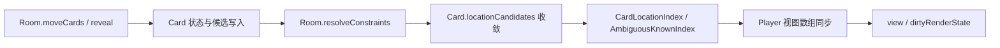

# Card / Player / Zone 模型（渐进式披露）

> 当任务涉及 `src/tracker/Card.ts`、`BaseCard.ts`、`Player.ts` 或 `Zone.ts`，需要排查牌实体
> 位置、候选、玩家区投影、公共区顺序，或新增玩家子区、装备容器、标记区语义时，按需阅读本文。
> 普通读取与调用方式先查 [`tracker_api.md`](tracker_api.md)；候选收敛与约束主流程见
> [`card_tracker_convergence.md`](card_tracker_convergence.md)；匿名牌堆、物化与 suspended 见
> [`card_tracker_anonymous_pile.md`](card_tracker_anonymous_pile.md)。

## 阅读路由

| 当前任务 | 建议阅读 | 说明 |
| --- | --- | --- |
| 理解模型字段与不变量 | 本文 | `Card` / `Player` / `Zone` 的状态分层和写入口 |
| 快速完成读取/移动/揭示 | [`tracker_api.md`](tracker_api.md) | 稳定的公开 API 与低层原语 |
| 修改候选、约束或收敛 | [`card_tracker_convergence.md`](card_tracker_convergence.md) | `locationCandidates`、`ConstraintGroup`、手牌数排他 |
| 处理匿名槽、物化、suspended | [`card_tracker_anonymous_pile.md`](card_tracker_anonymous_pile.md) | 负 ID 匿名实体与身份账本 |
| 定位 Room 与生命周期 | [`room.md`](room.md) / [`lifecycle.md`](lifecycle.md) | 单局容器、行为模块与挂载时序 |

## 核心分层

| 类 | 职责 | 不负责 |
| --- | --- | --- |
| `BaseCard` | 保存 ID 与从 `CardConfig` 读取的静态展示元数据 | 位置、候选、明暗状态 |
| `Card` | 单局运行时牌实体，保存物理身份、位置、候选、明暗、时间戳 | 玩家区数组的最终投影 |
| `Player` | 单座位的视图分组与手牌数事实 | 直接持有全局卡牌候选 |
| `Zone` | 公共区的有序 `Card[]` 关系 | 玩家手牌、装备、判定、标记的所有权 |

## BaseCard：静态元数据

- `BaseCard` 构造时通过 `CardConfig.GetInstance().getCard(id)` 自动拉取 `name`、`color`、
  `number`、`type`、`ncn`。
- `setCardInfo(id)` 是元数据刷新入口；匿名槽物化为真实身份时由
  `Card.materializeIdentity()` 调用，避免外部直接改写内部展示字段。

## Card：运行时牌实体

`Card` 是每张物理牌在单局中的唯一运行时实体，`Room.cards` 持有当前创建过的全部实例。
`id` 与 `entityID` 在真实身份下为正 ID；匿名槽使用稳定负 `entityID`，不再使用 `id = 0`。

| 字段 / 读面 | 语义 |
| --- | --- |
| `id` / `entityID` | 真实 CardID 或稳定负匿名句柄；匿名实体物化时原地切换为正 ID |
| `location` | 当前位置事实：公共区、`player` 或 `suspended` |
| `subZone` / `spellID` | 玩家区内的 `hand` / `equip` / `judge` / `mark` 及标记技能 ID |
| `isKnown` | 牌面是否已公开；不等于“身份已知”，也不等于位置确定 |
| `turn` / `round` / `phase` | 最近一次同步的轮次/阶段时间戳 |
| `owner` | 由 `syncOwnerFromSeats()` 从座位投影派生，不是独立候选状态 |
| `locationCandidates` | 完整位置候选唯一主模型 |
| `seats` | `locationCandidates` 的座位级只读投影 |
| `subZoneCandidates` | 玩家完整位置候选的只读投影 |
| `publicCandidates` | 牌堆顶/底等公共不确定位置的只读投影 |
| `suspended` | 候选范围过宽时暂停追踪的展示标记 |
| `combinationID` | 最近一次局部分组的展示/迁移标签，不是推理事实 |

### 候选主模型

- 外部写入候选必须走 `setLocationCandidates()`、`bindCandidates()`、`setSeats()`、
  `setSubZoneCandidates()` 等收口入口，不能直接修改 `locationCandidates`。
- `seats.size === 1` 只表示 owner 确定；`A 手牌 / A 标记` 仍可能在子区域层未收敛。
- 候选缩小时必须携带 `previousSeats`，否则收敛器无法恢复被剔除的座位。
- 装备容器候选使用 `type: 'container'` 与 `containerType: 'equipment'`，不直接同步到
  `seats` 或 `owner`，展示座位由投影层按装备当前位置解释。

### 常用状态迁移

- `confirmKnown()`：标记明牌并同步时间戳，不负责移动区域。
- `bindCandidates()` / `bindTo()`：绑定玩家区和候选/确定席位；`bindTo()` 默认确认明牌。
- `resolveLocationCandidate()`：候选只剩一个玩家位置时落定 `location`、`subZone` 与
  `spellID`。
- `moveToPublicZone()`：清空玩家区候选、`seats`、`combinationID` 与 `spellID`；移入
  `exile` / `outside` 时重置 `isKnown`。
- `reset()`：恢复初始牌堆状态并清空时间戳与候选。

## Player：座位视图

`Player` 由 `Room` 按座位持有，记录固定视图位序、手牌数事实和供渲染读取的视图分组。

| 字段 | 语义 |
| --- | --- |
| `seatID` / `fixedViewId` | 物理座位号和牌局显示顺位 |
| `hasObservedHandCount` / `observedHandCount` | 协议或移动事件给出的手牌总数事实 |
| `unknownCardCount` | 收敛后仍需匿名槽覆盖的暗牌额度 |
| `knownHandCards` | 确定普通手牌明牌，由 `Room.syncViewGroups()` 同步 |
| `candidateHandCards` | 仍属于手牌候选的已知牌，由视图同步写入 |
| `equipCards` / `judgeCards` | 装备区与判定区视图数组 |
| `markCards` | `spellID -> Card[]`，按技能隔离多个标记区 |
| `generals` / `figure` | 角色武将与阵营类型 |

- `knownHandCards`、`candidateHandCards`、`equipCards`、`judgeCards`、`markCards` 是投影
  缓存，不直接由外部 `push`；普通代码应读取 `room.locationIndex` 或调用
  `room.resolveConstraints()` 后再读。
- `cards` 是动态归组读面：`room.cards.filter((card) => card.location === 'player' &&
  card.seats.has(seatID))`，包含匿名暗牌，适合一次性归组而不是高频渲染。
- `getKnownHandSlotCount()` 和 `getCandidateHandSlotCount()` 返回占用槽位数，不是
  `Card[]` 长度；候选分组可能一张实体占用多个逻辑槽位。

## Zone：公共区有序关系

- `Zone` 只保存公共逻辑区的有序关系，`Card.location` 才是当前位置事实。
- 公共区包括 `pile`、`discard`、`process`、`exchange`、`exile`、`outside` 等；`pile.cards`
  内部顺序为牌底到牌顶。
- `add()` 负责从其它公共区移除旧关系、同步 `Card.location` 并按协议位置插入；
  `replaceAll()` 只用于初始化、洗牌等整区重建。
- 公共区不表达玩家手牌、装备、判定或标记区所有权；这些由 `Card.location === 'player'`
  与 `Player` 选择器表达。

## 同步链

普通移动先更新 `Card` 与 `Zone`，再由 `Room.resolveConstraints()` 稳定候选、对账匿名实体、
同步索引和玩家视图组。低层 `bindCandidates()` 等写入口后若不立即读取稳定投影，也需要显式
调用 `room.resolveConstraints()`。

## 核心不变量

- `locationCandidates` 是完整位置唯一主模型；`seats`、`subZoneCandidates`、
  `publicCandidates` 都是只读投影。
- owner 确定不表示子区域确定；`seats.size === 1` 不能替代完整位置约束。
- 匿名暗牌使用稳定负 `id/entityID`；`isKnown` 与真实身份是两件事，正 ID 不自动代表已公开。
- 同一张 `Card` 只能有一个当前位置；同一时间只应出现在一个公共 `Zone` 关系中或玩家区投影中。
- `Player` 的视图数组是收敛尾部投影，不是写入事实；手牌总数事实只来自
  `syncObservedHandCount()` / `applyObservedHandCountDelta()`。
- 候选或位置变化必须进入脏事件（含 `previousSeats`），否则增量索引和收敛轮次会漏更新或
  虚报变化。

## 修改护栏

- 新增玩家子区、装备容器或标记区时，同步补齐候选注册表、位置候选投影、索引投影、视图组
  同步和回归测试。
- 不要直接向 `room.cards`、`player.knownHandCards`、`player.candidateHandCards` 或
  `locationIndex` 桶数组 `push`。
- 不要用 `Zone.add()` 代替协议移动；普通移动必须走 `Room.moveCards()` 或
  `TrackerController.syncTrackerMove()`，否则会漏掉身份账本、手牌总数和收敛。
- 匿名槽物化优先使用 `Room.materialize()`，不要为已存在匿名来源槽的身份再次
  `createExternalCards([cardID])`。
- 候选写入口必须保持幂等 `changed` 语义；重复写入相同候选不能驱动下一轮收敛。

## 验证与进一步阅读

- [`tracker_api.md`](tracker_api.md)：读取手牌、揭示、移动、匿名补位 API。
- [`room.md`](room.md)：Room 状态所有权、生命周期、写入管线与行为模块边界。
- [`card_tracker_convergence.md`](card_tracker_convergence.md)：收敛终止、数量约束与索引。
- [`card_tracker_anonymous_pile.md`](card_tracker_anonymous_pile.md)：匿名槽、物化、suspended。
- [`lifecycle.md`](lifecycle.md)：Room/View 挂载与对局运行周期。

模型相关修改按 [`testing.md`](testing.md) 选择 `pnpm test:tracker`、类型检查、lint 与 build；
仅修改本文档无需构建。
