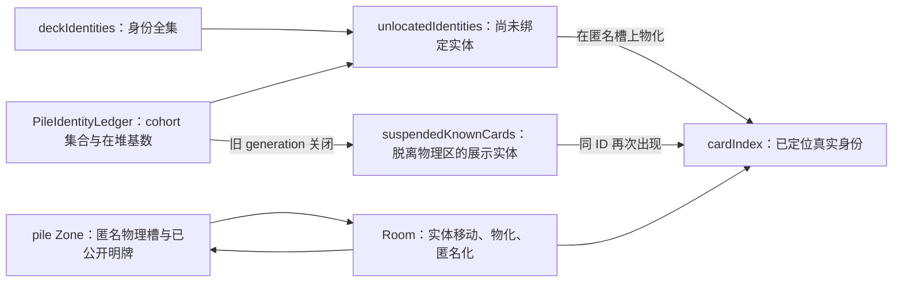

# 匿名牌堆、身份账本与物化模型

> 当任务涉及匿名牌堆槽、`PileIdentityLedger`、cohort/generation、`unlocatedIdentities`、
> `suspendedKnownCards`、牌堆明牌物化、洗牌身份守恒或“先创建暗占位、后揭示身份”的协议时，
> 按需阅读本文。
>
> 本文描述当前生产运行时契约，不代表把 cohort 分组接入用户界面。历史方案、真实回放证据与
> NO-GO/收缩过程分别见 [`replay.md`](replay.md) 和 `plans/` 下的归档。

## 快速结论

- 牌堆中的暗牌首先是**物理槽**，使用稳定负 `id/entityID`；它不代表某个具体 CardID。
- 真实身份由 `Room.deckIdentities`、`Room.unlocatedIdentities`、`Room.cardIndex` 与
  `PileIdentityLedger` 分层维护。
- `PileIdentityLedger` 是不可关闭的生产牌堆身份权威；cohort 只记录“候选身份集合中仍有几张在
  牌堆”，不建立 CardID 与匿名槽的一一映射。
- 已知身份首次出现时，优先在协议覆盖的匿名端点上物化；不能越过端点范围扫描整副牌堆，也不能
  覆盖另一个正 ID 暗实体。
- 真实洗牌关闭旧 generation 时，尚未出现的身份转为 detached `suspendedKnownCards` 展示实体；
  它们不占牌堆、手牌或 mark 物理槽。
- 协议张数大于本地可枚举实体时只告警，不凭空补建牌堆槽。

## 按问题定位

| 问题 | 首选符号 / 文件 | 回归入口 |
| --- | --- | --- |
| 初始化为什么只有负 ID 暗槽 | `Room.initDeck()`、`Card` | `pileIdentityLedgerIntegration.test.ts` |
| 匿名移动从哪里取实体 | `RoomMovement.moveUnknownCardsForContext()`、`RoomMovementSourceMethods.takeSourceCards()` | `trackerController.test.ts`、`pileDisplayOrder.test.ts` |
| 正 ID 如何绑定到匿名槽 | `Room.materialize()`、`RoomMovement.resolveKnownMoveCards()` | `publicEndpointCards.test.ts`、`knownDiscardConfirm.test.ts` |
| cohort 如何消费、合并和降级 | `PileIdentityLedger.applyMove()` | `pileIdentityLedger.test.ts` |
| 洗牌如何关闭旧世代 | `Room.shufflePile()`、`PileIdentityLedger.createShuffleTransition()` | `pileIdentityLedgerIntegration.test.ts` |
| suspended 身份如何恢复 | `Room.suspendUnresolvedPileIdentitiesForShuffle()`、`Room.resumeSuspendedKnownCard()` | `pileIdentityLedgerIntegration.test.ts` |
| 账本与 Room 为什么不一致 | `Room.assertPileIdentityLedgerConsistency()`、`PileIdentityLedger.getSnapshot()` | `pileIdentityLedger.test.ts`、`traversalBaseline.test.ts` |

## 三层模型



### 物理实体层

- `Room.cards` 保存当前单局创建过的 `Card` 实体。
- `Zone('pile')` 保存有序物理牌堆，内部顺序为牌底到牌顶。
- 未公开牌堆槽必须是稳定负 `id/entityID` 的匿名实体；`id=0` 只允许作为输入语义，不能写入实体。
- 牌堆中可以存在已经公开的正 ID 明牌，例如已确认的牌顶或牌底；禁止存在正 ID 暗牌堆实体。
- 匿名实体离开牌堆后可以继续作为手牌、mark、交换区、处理区或 12 区的物理占位。

### Room 身份分区层

| 状态 | 含义 | 是否占物理区域 |
| --- | --- | --- |
| `deckIdentities` | 当前单局已知的真实身份全集；游戏外新身份首次出现时会扩展 | 否 |
| `unlocatedIdentities` | 身份存在，但尚未绑定到具体 `Card` 实体 | 否 |
| `cardIndex` | 正 ID 已绑定到实体，可位于公共区、玩家区或 suspended | 取决于实体位置 |
| `suspendedKnownCards` | 旧世代未决身份的 detached 展示实体，位于 `location='suspended'` | 否 |

`suspendedKnownCards` 中的牌仍登记在 `cardIndex`，但不属于任何物理 `Zone` 或玩家槽。它们用于保留
“这个身份曾属于已关闭的旧牌堆世代、当前具体位置未知”的展示事实。

### PileIdentityLedger 层

`PileIdentityLedger` 不移动实体，只维护牌堆身份事实：

- `identityUniverse`：账本知道的身份全集。
- `locatedIdentityIDs`：已经被协议定位到具体区域或实体的身份。
- `knownPileIdentityIDs`：明确仍在牌堆中的公开身份。
- `knownDiscardIdentityIDs`：明确位于弃牌堆的身份，用于下一次洗回建立新批次。
- `cohorts`：尚未精确定位的身份集合与集合级在堆数量。
- `generation`：真实弃牌洗回关闭旧牌堆世代时递增。
- `revision`：成功提交账本事务后递增，用于诊断快照。

一个 cohort 的核心结构是：

```ts
interface PileIdentityCohort {
  generation: number
  candidateIdentityIDs: Set<CardID>
  remainingPileCount: number
}
```

它表达：`candidateIdentityIDs` 这组身份中，仍有 `remainingPileCount` 张位于匿名牌堆槽。它不表达
具体是哪几张，也不表达它们分别对应哪个物理槽。

投影时分为三类：

- `all-in-pile`：`remainingPileCount === candidateIdentityIDs.size`。
- `none-in-pile`：`remainingPileCount === 0`。
- `partial`：数量介于两者之间。

## 核心不变量

### 物理牌堆守恒

```text
accountedPileCount
= knownPileIdentityIDs.size + Σ cohort.remainingPileCount
= pile.cards.length
```

其中 `Σ cohort.remainingPileCount` 是匿名暗槽数，公开牌堆身份由
`knownPileIdentityIDs` 单独计数。

### cohort 基数守恒

每个 cohort 都必须满足：

```text
0 <= remainingPileCount <= candidateIdentityIDs.size
```

不同 cohort 的身份集合互斥；cohort 身份不能同时出现在 `locatedIdentityIDs` 或
`knownPileIdentityIDs` 中。

### Room 分区守恒

每个仍属于 cohort 的身份，在 Room 中必须且只能由以下一种状态承载：

- 位于 `unlocatedIdentities`；或
- 位于 `suspendedKnownCards`。

不能两边都没有，也不能同时存在于两边。

### 暗牌堆匿名

`pile.cards` 中 `isKnown !== true` 的实体必须是稳定负 ID 匿名槽。若 DEV 一致性检查发现正 ID
暗实体，会产生 `hidden-pile-identity` 问题和“牌堆仍存在正 ID 暗实体”告警。

### 不建立逐槽身份映射

匿名槽只承担物理张数、顺序和移动位置。不要给每个匿名槽分配“代表 CardID”，也不要因为匿名槽
被摸走就任意从大候选集合中删除一个身份。协议不能证明边界时，账本应合并或降级 cohort，而不是
虚构精度。

## 关键生命周期

### 初始化

`Room.initDeck(cardIDs)`：

1. 为每个输入身份创建一个稳定负 ID 匿名牌堆槽。
2. 将所有正 ID 写入 `deckIdentities` 与 `unlocatedIdentities`。
3. 初始化 generation 0 的单个 cohort，候选集合与在堆基数都等于牌组身份数。
4. 重建位置索引、候选索引与计数器。

初始化后没有 CardID 与匿名槽的一一绑定。

### 匿名牌离开牌堆

- 常规摸牌 `MoveType=1` 必须按协议端点顺序移动实际实体；若端点包含已公开明牌，Controller 会把
  对应身份作为 `knownPileIdentityIDsConsumed` 精确提交给账本。
- 非标准牌堆获得且 `CardIDs=[]` 时只消费匿名槽，跳过全部已公开牌堆身份；`POSITION_RANDOM` 只表示
  匿名代表和批次边界不确定，不证明某个已知身份离堆。
- `discard`、`process`、`exchange`、`exile` 等非牌堆公共来源在 `CardIDs=[]` 时仍按端点取实际实体，
  不能套用“只取匿名槽”的牌堆特例。

### 已知身份物化

`RoomMovement.resolveKnownMoveCards()` 依次尝试：

1. 来源端点中已经存在同 ID 实体时精确复用。
2. 在本次协议 `cardCount` 覆盖的端点范围内选择匿名槽，并调用 `Room.materialize()`。
3. 若身份是 suspended，恢复原身份并让匿名端点退出公共区。
4. 端点确实没有合法物理槽时，才按外部来源或 known fallback 补建实体并记录诊断。

公共 known 物化不能：

- 扫描协议端点范围外的整副牌堆寻找匿名槽；
- 穿透端点上的正 ID 实体寻找更深处匿名槽；
- 用一个正 ID 暗实体承接另一个 CardID；
- 为已经存在匿名来源槽的牌再次 `createExternalCards([cardID])`。

### 游戏外来源的两阶段揭示

典型协议会先创建物理牌，下一条消息才给出身份：

1. `outside(0) -> exile(12)`、`CardIDs=[]`：`takeSourceCards()` 创建匿名暗占位并移入 12 区。
2. `exile(12) -> player/equip`、`CardIDs=[id]`：known 路径在 12 区来源端点物化同一实体，再移入
   玩家区。

该流程必须保证：

- 第二条消息复用第一条消息创建的 `Card` 对象和物理槽；物化时负 `id/entityID` 会切换为真实正 ID；
- 12 区不残留旧匿名实体；
- `Room.cards` 不因身份揭示额外增加一张牌；
- 若前置匿名槽确实缺失，仍允许按合法游戏外实体补建，并保留日志诊断。

### 已知或匿名牌回到牌堆

- 明确位置的已知牌进入牌堆时，账本登记为 `knownPileIdentityIDs`，物理 `Zone` 保存端点顺序。
- 随机插入已知牌无法保留批次边界时，Room 会把物理实体匿名化，身份回到 cohort。
- 匿名回堆只能增加物理暗槽数量，无法证明具体身份或精确插入边界，因此统一保守合并/降级。
- 协议声明的牌堆张数大于物理实体数时只告警，不补建匿名牌堆槽。

### 洗牌与 generation

真实弃牌洗回由 `Room.shufflePile()` 处理，顺序与普通移动不同：

1. `PileIdentityLedger` 先原子提交旧 cohort 关闭和新批次建立。
2. Room 根据已提交的 `PileIdentityShuffleTransition` 处理 `expiringIdentityIDs` 与
   `recycledIdentityIDs`。
3. 旧 generation 尚未出现的身份转成 detached suspended 展示实体。
4. 洗回弃牌实体全部匿名化，再与剩余牌堆实体重建物理牌堆。
5. 收敛并执行 Room/ledger 最终一致性检查。

开局 `2 -> 9` 的两种形态不关闭 generation 0：

- 弃牌堆数量为 `0`；或
- 弃牌堆数量等于整副身份全集。

只有后续部分弃牌真实洗回才视为 generation 滚动，并创建旧世代 suspended 身份。

## Controller、Room 与 Ledger 的职责边界

| 层 | 负责 | 不负责 |
| --- | --- | --- |
| `TrackerController` | 归一化协议、收集物理移动前后数量、构造 `PileIdentityLedgerMove` | 直接修改 cohort 或 Card 内部状态 |
| `Room` / `RoomMovement` | 选择来源实体、移动物理槽、物化/匿名化、恢复 suspended、维护索引 | 自行猜测 cohort 中具体是哪张牌 |
| `PileIdentityLedger` | 提交身份集合、已知牌堆/弃牌身份、cohort 基数与 generation 事务 | 操作 `Card`、`Zone`、玩家区或 UI |

普通移动先完成 Room 物理移动，再提交账本并按最终物理数量对账。洗牌必须先提交账本世代事务，再
重建物理牌堆，避免物理状态领先于身份权威。

## 诊断快照

`PileIdentityLedger.getSnapshot()` 的常用字段：

| 字段 | 用途 |
| --- | --- |
| `revision` | 判断事务是否成功提交、状态是否发生变化 |
| `identityUniverseIDs` | 账本身份全集 |
| `locatedIdentityIDs` | 已有精确位置的身份 |
| `knownPileIdentityIDs` | 明确位于牌堆的公开身份 |
| `knownDiscardIdentityIDs` | 明确位于弃牌堆的身份 |
| `hiddenPileSlotCount` | 所有 cohort 的匿名在堆基数之和 |
| `accountedPileCount` | 明牌身份数加匿名槽数，应等于物理牌堆张数 |
| `cohort.groups` | generation、候选身份集合、在堆基数与 `all/none/partial` 分类 |

常见症状与检查方向：

| 症状 | 优先检查 |
| --- | --- |
| 揭示后来源区残留匿名牌或实体总数增加 | `resolveKnownMoveCards()` 是否物化来源匿名端点；是否误走 `createExternalCards()` |
| 牌堆出现正 ID 暗牌 | 回堆/洗牌后是否调用 `anonymizeLocatedIdentity()`；查看 `hidden-pile-identity` |
| `pile-count-mismatch` | `knownPileIdentityIDs`、cohort 基数与 `pile.cards.length` 是否同步消费 |
| 某身份既不在 Room 也不在 suspended | `cohort-identity-missing-from-room-partition` |
| 某身份同时 unlocated 与 suspended | `cohort-identity-duplicated-in-room-partition` |
| 匿名获得错误消耗牌顶明牌 | 是否误把非标准无 ID 获得按常规端点摸牌处理 |
| 非牌堆来源残留明牌 | 是否错误套用了“只消费匿名槽”的牌堆规则 |
| 洗牌产生过多 suspended | 是否错误关闭了开局 generation 0，或把已公开身份留在 cohort |

## 修改护栏

- 新协议优先将原始消息交给 `tracker.syncTrackerMove()`，不要在 handler 中直接改
  `PileIdentityLedger`。
- 只有确实代表游戏外新实体时才使用 `createExternalCards()`；已存在匿名槽时应物化。
- 新增公共 known 路径时必须测试端点范围、正 ID 暗端点、匿名槽不足和重复消息幂等。
- 新增无 CardIDs 路径时先区分牌堆与非牌堆来源，再决定“只取匿名槽”还是“取实际端点实体”。
- 修改洗牌逻辑时同时验证物理槽数、cohort 基数、公开牌顶/牌底、suspended 分区及连续洗牌。
- 不把 `PileIdentityLedgerSnapshot.cohort` 直接接入用户 UI；当前产品裁决仍是不展示 cohort 分组。

## 测试与验证

主要回归文件：

- `tests/tracker/pileIdentityLedger.test.ts`：纯账本事件、cohort 基数、降级、守恒与快照。
- `tests/tracker/pileIdentityLedgerIntegration.test.ts`：Controller/Room/ledger 事务、洗牌与 suspended。
- `tests/tracker/trackerController.test.ts`：协议端到端移动、游戏外实体、两阶段匿名揭示。
- `tests/tracker/knownDiscardConfirm.test.ts`：known 缺口、正 ID 暗实体确认与诊断。
- `tests/tracker/publicEndpointCards.test.ts`、`pileDisplayOrder.test.ts`：端点选择、物化与物理顺序。
- `tests/tracker/traversalBaseline.test.ts`：匿名生产路径与历史已物化对照的遍历护栏。
- `tests/contracts/pile-identity/`：长期纯模型与真实牌序 oracle。

涉及本模型的代码修改至少运行：

```text
pnpm test:tracker
pnpm typecheck:tracker
pnpm lint
pnpm build
```

核心协议、洗牌或发布风险变更再运行 `pnpm build:prod`。仅修改本文档无需构建。

## 进一步阅读

- [`card_tracker.md`](card_tracker.md)：记牌器整体模块边界与风险清单。
- [`tracker_api.md`](tracker_api.md)：移动、揭示、物化与匿名补位 API 速查。
- [`testing.md`](testing.md)：测试分层、牌堆身份契约和验证命令。
- [`replay.md`](replay.md)：匿名槽真实回放与历史裁决证据。
- [`plans/anonymous-entity-and-slot.md`](../../plans/anonymous-entity-and-slot.md)：稳定负 ID 与匿名槽阶段的历史收缩结论。
- [`plans/pile-identity-cohort-plan.md`](../../plans/pile-identity-cohort-plan.md)：生产 cohort 账本迁移、验证与最终裁决归档。
- [`plans/pile-generation-identity-pool-plan.md`](../../plans/pile-generation-identity-pool-plan.md)：世代身份卡池纯模型和 NO-GO 证据。
