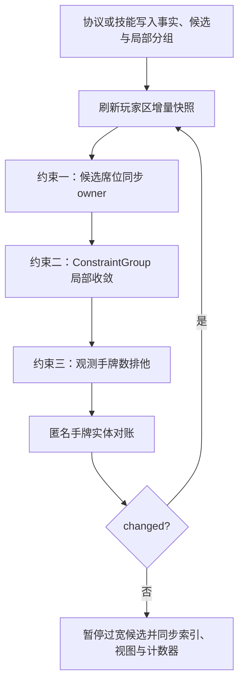

# 记牌器约束收敛（按需）

> 💡 仅在修改 `Room.resolveConstraints()`、`ConstraintGroup`、完整位置候选、观测手牌数排他、匿名手牌实体对账，或排查过度收敛、欠收敛、空转与遍历量回归时阅读本文。记牌器整体边界先读 [`card_tracker.md`](card_tracker.md)；常用状态写入方式先查 [`tracker_api.md`](tracker_api.md)。

---

## 阅读路由

| 当前任务 | 建议阅读范围 | 后续文档 |
| --- | --- | --- |
| 修改 Card/Player/Zone 字段或写入口 | [`card_player_model.md`](card_player_model.md) | 模型不变量与候选主模型 |
| 快速理解收敛主流程 | 「目标与边界」和「不动点主循环」 | 无 |
| 新增协议或技能候选 | 「不动点主循环」和「扩展检查清单」 | [`card_tracker_skills.md`](card_tracker_skills.md) |
| 排查不终止或状态不刷新 | 「终止性与 `changed` 契约」和「常见故障定位」 | [`testing.md`](testing.md) |
| 优化遍历或索引同步 | 「增量执行与稳定尾部」和「性能护栏」 | [`testing.md`](testing.md) |
| 只需调用现有能力 | 不必继续阅读本文 | [`tracker_api.md`](tracker_api.md) |

## 目标与边界

`Room.resolveConstraints()` 的职责，是在当前协议事实、候选位置、局部数量约束和观测手牌数之间求出一个稳定状态。稳定状态意味着再执行一轮不会继续改变候选、owner、匿名手牌实体或相关派生计数。

收敛遵循以下边界：

- **保守**：没有协议事实或完整数量约束时保留候选，不用实体数组顺序、匿名占位身份或 UI 投影补造事实。
- **局部**：`ConstraintGroup` 只约束本组卡牌；同组不等于同 owner，也不允许把局部名额扩成全局消元。
- **分层**：座位、玩家完整位置、公共位置与装备容器是不同层级；owner 确定不代表子区域确定。
- **幂等**：已经稳定的输入再次收敛必须返回不变；展示标签或重复投影不能虚报状态变化。
- **可观测**：候选、位置或 owner 变化必须进入脏事件与触碰座位集合，使增量快照、索引和后续轮次能看到变化。

推理阶段通常只缩小候选集合；匿名手牌实体对账可能补建或释放占位实体，因此会触发额外一轮，但不能引入没有物理数量依据的牌。

## 核心不变量

- `Card.locationCandidates` 是完整位置候选的唯一主模型；`seats`、`subZoneCandidates` 与 `publicCandidates` 都是兼容投影。
- `card.seats.size === 1` 只足以同步 `owner`。若仍存在 `A 手牌 / A 标记` 等多个完整位置候选，具体子区域尚未收敛。
- `expectedSlotsBySeat` 只表达“本组有几张普通手牌属于某座位”，不能替代完整位置名额。
- `expectedSlotsByLocation` 是玩家区、公共区与装备容器的主数量约束；只有候选全集已被该局部分组覆盖时，才能执行强锁推理。
- `expectedSlotsBySubZone` 是迁移期兼容镜像；存在 `expectedSlotsByLocation` 时，以完整位置层为准。
- 未调用 `syncObservedPlayerHandCount()` 的玩家没有手牌数事实；默认值或负向差量不能被解释为“观测到 0 张”。
- 匿名实体只覆盖已知物理数量缺口，不代表某个未公开 CardID，也不能用于证明具体牌序或 owner。

## 不动点主循环

### 约束一：候选席位同步 owner

`Card.syncOwnerFromSeats()` 在座位投影只剩一个值时同步 owner。该阶段不负责解析手牌、标记、装备容器或公共区等完整位置，也不能清除同一 owner 下仍然有效的多个子区域候选。

### 约束二：局部 `ConstraintGroup`

`ConstraintGroup.resolve()` 按以下层次处理本组卡牌：

1. `candidateSeats` 与卡牌现有座位候选取交集。
2. `expectedSlotsBySeat` 处理没有完整子区域候选的普通手牌。
3. `expectedSlotsByLocation` 处理玩家完整位置、公共位置与装备容器。
4. 仅在没有完整位置主约束时，使用 `expectedSlotsBySubZone` 兼容路径。
5. 对尚未由本轮位置操作同步 owner 的玩家区卡牌，再执行一次 owner 同步。

数量约束只有两类安全推理：

- 确定牌已经占满名额时，从其余候选牌中剔除该位置。
- 候选牌数量不超过剩余名额时，只有这些牌的所有完整位置候选都被本组 `expectedSlotsByLocation` 覆盖，才可把它们锁定到该位置；只要仍能逃逸到组外位置，就必须保留不确定性。

公共位置按完整 key 匹配，不能用同一公共区中的任意确定牌提前占满牌顶/范围名额。装备容器候选收敛后仍保持 container 语义，展示座位由投影层根据装备当前位置计算。

`combinationID` 是展示与迁移标签，不是推理事实。同一张牌可属于多个约束组，标签被后处理组覆盖时不能让 `changed` 变为 `true`。

### 约束三：观测手牌数排他

对已经观测手牌总数的玩家，收敛器统计确定手牌明牌与候选手牌槽。当确定明牌已经占满观测总数时，才从其他卡牌中删除该玩家的“手牌”候选。

该排他只删除目标座位的手牌位置，不应删除同座位标记、装备容器或公共区候选。完整位置候选由位置层约束处理，不能退化为直接删除整个 seat。

### 匿名手牌实体对账

三类约束完成后，`reconcileAnonymousHandCards()` 根据观测手牌数、确定明牌和模糊明牌槽位补建或释放匿名手牌实体。实体数量变化会改变玩家区快照，必须把本轮标记为有变化并重新执行全部约束。

## 增量执行与稳定尾部

收敛循环使用三类增量机制：

- **A2：玩家区增量快照**。`Room.refreshPlayerSnapshot()` 按 `dirtyCardEvents` 游标维护 `playerCardsSnapshot`；事件断档时回退全量重建，开发构建由 `assertPlayerSnapshotConsistency()` 校验。
- **E1：手牌槽按座位缓存**。首轮批量计算有观测手牌数的座位，后续轮次只为受影响座位懒重算；缓存只在单次 `resolveConstraints()` 内有效。
- **E2：跳过未触碰座位**。首轮处理全部玩家，后续轮次跳过上一轮与本轮至今都未触碰的座位。

`Room.notifyCardChanged()` 会把变更后的 `card.seats`、事件中的 `previousSeats`，以及前后 owner / resolved seat 加入 `resolveTouchedSeats`。候选缩小时，被删除的座位只能从 `previousSeats` 恢复，因此新增候选变更路径必须保留这一事件信息。

达到不动点后，`resolveConstraints()` 依次完成：

1. 暂停追踪候选范围过宽的明牌。
2. 按脏卡牌事件与 `dirtyPublicZones` 增量更新 `CardLocationIndex`。
3. 同步玩家视图组。
4. 约束组结构变化时全量重建 `AmbiguousKnownIndex`，否则按脏事件增量更新。
5. 更新 `CardCounter`，并执行守恒断言。

索引游标断档允许回退全量重建；正常路径不应主动绕过增量入口。

## 终止性与 `changed` 契约

每个参与收敛的方法都必须遵守：只有语义状态确实发生变化时才返回 `true`。重复写入相同候选、重复同步相同 owner、重复投影多座位候选或切换单值展示标签，都不能驱动下一轮。

- 正常场景通常在不超过 2 轮内稳定。
- `Room.lastResolveRounds` 记录最近轮数，`Room.maxResolveRounds` 单调记录本局历史最大轮数。
- 开发构建中超过 8 轮会告警，提示可能存在虚报 `changed` 的非终止回归。
- 循环保留 100 轮硬上限作为最后兜底；命中上限不是可接受的正常完成条件。

任何会在轮内改变 `card.location`、候选集合、seat 或 owner 的新路径，都必须同时满足：状态变更可被 `changed` 观察，变更通过卡牌候选 API 发出脏事件，受影响座位进入 `resolveTouchedSeats`。

## 性能护栏

- 不要在玩家循环、约束组循环或收敛轮循环内新增未复用的全牌池扫描。
- 优先使用玩家区快照、位置索引、局部分组、脏事件集合或入口一次性归组结果。
- 确认必须新增全量扫描时，使用 `recordTraversal(...)` 插桩，并在 [`tests/tracker/traversalBaseline.test.ts`](../../tests/tracker/traversalBaseline.test.ts) 中记录场景与内联快照。
- 遍历数字因结构性优化下降可以更新快照；无关改动导致数字上升时，应先解释新增成本和无法复用现有索引的原因。

## 扩展检查清单

新增候选或约束前，依次确认：

1. 这条推理依据的是哪一项协议事实，是否存在缺席负证据。
2. 约束属于 seat、玩家完整位置、公共位置还是装备容器层。
3. `ConstraintGroup.cards` 是否只包含本次局部事件相关实体。
4. 强锁所需的候选全集是否已被 `expectedSlotsByLocation` 完整覆盖。
5. 是否错误地把 owner 确定当成子区域确定，或把同组当成同 owner。
6. 候选变更是否经 `Card` 的候选 API 发出包含变更前后座位的信息。
7. `changed` 是否仅在真实变化时为 `true`，匿名实体增减是否会重新进入下一轮。
8. 新状态是否能被 `CardLocationIndex`、`AmbiguousKnownIndex`、视图组和 `CardCounter` 正确投影。
9. 是否新增全牌池扫描；若是，是否已有遍历插桩和基线说明。
10. 是否补充了最小收敛回归、终止性回归和相关协议场景测试。

## 常见故障定位

| 现象 | 优先检查 |
| --- | --- |
| 收敛轮数持续升高或命中上限 | setter 是否重复返回 `true`；`combinationID` 或多座位重投影是否误当成状态变化 |
| owner 正确但手牌/标记位置错误 | 是否把 `seats.size === 1` 当成完整位置；是否缺少 `expectedSlotsByLocation` |
| 某座位第二轮没有重新计算 | 候选变更事件是否携带 `previousSeats`；owner 前后座位是否进入 `resolveTouchedSeats` |
| 已满手牌误删标记或容器候选 | 约束三是否只删除目标座位的 hand 候选；是否错误退化为 seat 级删除 |
| 强锁后出现过度收敛 | 参与强锁的牌是否还有组外完整位置候选；数量约束是否创建得过早 |
| 收敛结果正确但索引或 UI 陈旧 | 是否遗漏脏卡牌事件、`dirtyPublicZones` 或约束组结构 dirty 标记 |
| 遍历基线意外上升 | 是否在嵌套循环中新增 `this.cards.filter(...)`，或绕过已有快照与索引 |

## 验证路由

收敛核心变更至少关注以下回归：

- [`tests/tracker/convergenceTermination.test.ts`](../../tests/tracker/convergenceTermination.test.ts)：幂等与终止轮数。
- [`tests/tracker/locationCandidates.test.ts`](../../tests/tracker/locationCandidates.test.ts)：owner 与完整位置候选边界。
- [`tests/tracker/handCountObservation.test.ts`](../../tests/tracker/handCountObservation.test.ts)：观测手牌数、匿名实体与排他逻辑。
- [`tests/tracker/resolveConstraintsIncrementalIndex.test.ts`](../../tests/tracker/resolveConstraintsIncrementalIndex.test.ts)：收敛尾部增量索引一致性。
- [`tests/tracker/ambiguousKnownIndexIncremental.test.ts`](../../tests/tracker/ambiguousKnownIndexIncremental.test.ts)：模糊明牌索引增量一致性。
- [`tests/tracker/traversalBaseline.test.ts`](../../tests/tracker/traversalBaseline.test.ts)：遍历量护栏。

涉及暗置标记、公共候选、随机手牌转移或具体技能时，再补读对应测试与 [`card_tracker_skills.md`](card_tracker_skills.md)。完整命令和补测规则以 [`testing.md`](testing.md) 为准，不在本文重复维护测试数量或历史里程碑。
