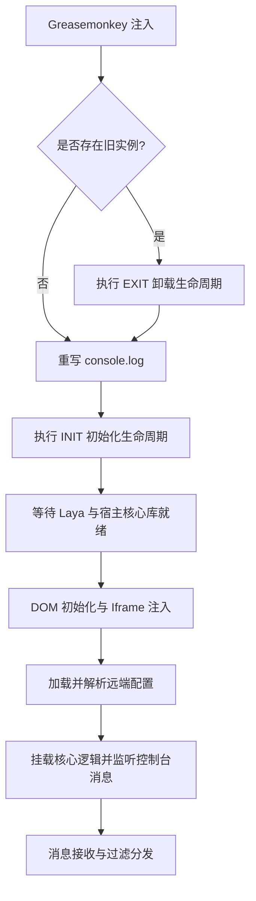
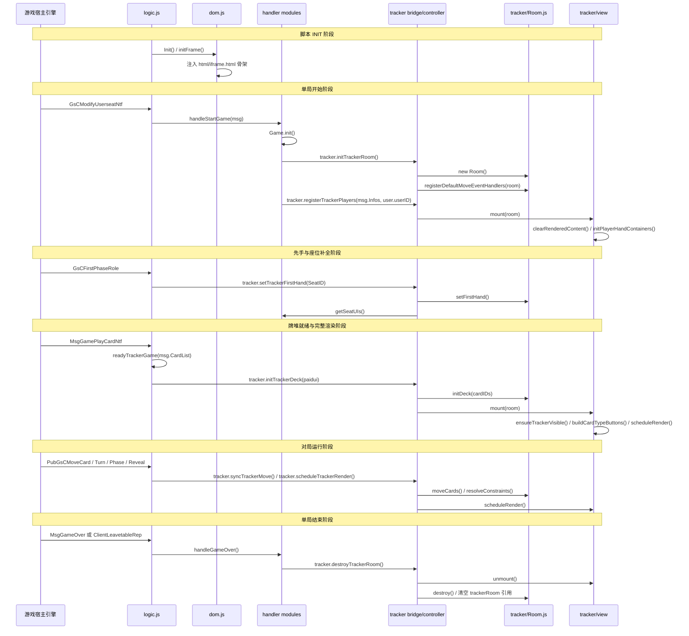
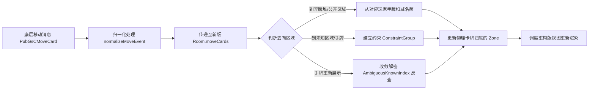

# 三国杀小抄项目生命周期机制深度解析报告

本文档对“三国杀小抄”浏览器用户脚本项目的各类生命周期机制进行深入解析。主要内容包括应用整体运行周期、核心模块/组件的初始化与销毁流程、游戏局内数据流转与状态变更周期的时序、关键代码入口与流转逻辑。

---

## 一、 应用整体运行周期 (Application Lifecycle)

应用整体运行周期指用户脚本加载、挂载、消息分发以及卸载的完整生命周期。整个生命周期由入口文件 [`src/index.js`](src/index.js) 进行编排，核心流转如下图所示：

### 1. 初始化阶段 (INIT Lifecycle)

- **触发条件**：脚本在页面加载的 `document-start` 阶段被注入并执行，首先进行全局检查，然后由 [`src/index.js:main()`](src/index.js:43) 调用 `main('INIT')` 触发。
- **执行时序与关键代码入口**：
  1. 调用 [`src/dom.js:Init()`](src/dom.js:38) 作为 UI 和 DOM 的入口引导器。
  2. 调用 [`src/ui/lifecycle.js:bindInitialResize()`](src/ui/lifecycle.js:1) 绑定窗口缩放事件。
  3. 执行 [`src/ui/lifecycle.js:waitForLegacyFrameReady()`](src/ui/lifecycle.js:25)。该函数在 Promise 链中通过定时器高频轮询检查宿主环境的关键类库（`JSZipUtils`、`CtrUtil`等）和核心 DOM 节点（`#bgDiv`）是否就绪。
  4. 宿主环境就绪后，回调触发 [`src/dom.js:initFrame()`](src/dom.js:71)。
  5. [`src/dom.js:initFrame()`](src/dom.js:71) 顺序执行：
     - 清除先前残留的注入 DOM 节点。
     - 监听 resize 窗口缩放事件与自定义的 `SGSresize` 屏幕比例变更事件。
     - 调用 [`src/ui/lifecycle.js:installSystemContextResizeDispatchers()`](src/ui/lifecycle.js:57)，劫持并代理宿主 `SystemContext` 对象的 `gameScreenType` 和 `gameScale` 属性，发生变化时派发 `SGSresize` 自定义事件。
     - 调用 `addSeatUI` 和 [`src/dom.js:addFrame()`](src/dom.js:407)，创建主骨架并异步通过 [`src/utils/htmlResource.js:loadInterfaceHtml()`](src/utils/htmlResource.js) 加载远端 `iframe.html` 界面。
     - 调用 [`src/config/ConfigManager.js:loadAndParseConfigs()`](src/config/ConfigManager.js:25) 异步加载和解析远端卡牌、技能及山河图配置压缩包并完成初始化。
  6. 当 [`src/index.js:main()`](src/index.js:43) 中 `main('INIT')` 的 Promise 链（[`src/index.js:57`](src/index.js:57)）解析成功后，将主入口 `main` 推入宿主全局注册数组 `window.SGSMODULE` 中，完成初始化。

### 2. 消息分发阶段 (Message Dispersal Lifecycle)

- **触发条件**：宿主游戏底层输出日志，触发被重写后的 `console.log`，重定向至 `sgsConsoleLog`。
- **执行时序与关键代码入口**：
  1. 被劫持的 `window.console.log` 对应为 [`src/index.js:sgsConsoleLog()`](src/index.js:29)。
  2. 遍历 `window.SGSMODULE` 列表，将底层消息分发给所有的订阅函数（包括小抄的 `main` 函数）。
  3. 经过 [`src/index.js:main()`](src/index.js:43)，提取消息对象 `msg`，进入消息分发路由 [`src/logic.js:logic()`](src/logic.js:55)。
  4. 路由逻辑首先通过 [`src/featureFlags.js:isRetainedLogicMessage()`](src/featureFlags.js:46) 检查当前事件名称是否在消息白名单（`retainedLogicMessages`）中。
  5. 经过白名单过滤后，根据事件的 `ClassName` / `className` 分发至对应的处理器（位于 `src/handler/` 目录下）。

### 3. 卸载阶段 (EXIT Lifecycle)

- **触发条件**：当页面重新加载、脚本热重载，或者显式卸载小抄时触发。
- **执行时序与关键代码入口**：
  1. [`src/index.js`](src/index.js:8) 判断若已存在全局 `SGSMODULE` 对象，则先对其元素广播 `'EXIT'` 消息，并清空还原 `window.console.log` 描述符。
  2. 进入 [`src/dom.js:Exit()`](src/dom.js:44)，接着调用 [`src/ui/lifecycle.js:cleanupLifecycle()`](src/ui/lifecycle.js:16)。
  3. `cleanupLifecycle` 依次移除之前绑定的 `resize`、`SGSresize` 事件监听器，清空 `SGSMODULE` 数组。
  4. 执行 [`src/ui/lifecycle.js:removeInjectedDom()`](src/ui/lifecycle.js:7)，彻底清理注入的座位 UI、山河图 UI、背景层及 iframe 元素，恢复页面原始 DOM 状态。

---

## 二、 重构版记牌器生命周期

重构版记牌器当前已经是主动运行实现。它的生命周期不是“脚本 INIT 时立即创建并挂载”，而是被拆成了两层：应用启动时只注入承载 UI 的页面骨架；真正的单局 `Room` 要等游戏开始协议到达后创建。视图挂载是两段式的：玩家注册后先早期挂载，清理主面板并按人数初始化固定手牌容器；牌堆协议到达后再补齐统计按钮、公共区、玩家手牌和查询面板的完整渲染。

### 1. 应用 INIT 期：只准备承载环境，不创建单局 Room

- **触发条件**：用户脚本进入 `main('INIT')`。
- **关键职责**：注入外层 DOM、座位覆盖层与主面板 HTML，加载配置，建立消息分发入口。
- **重要边界**：这一阶段不会调用 `initTrackerRoom()`，也不会执行 `view.mount()`。`src/tracker/view/index.ts` 依赖主文档中的 `#orderAndShouPai`、`#button`、`#knownCards`、`#paiduiCards`、`#qipaiCards`、`#cardDetail` 等节点；这些节点来自 INIT 阶段加载的 `html/iframe.html` 骨架。

也就是说，INIT 期完成的是“可挂载的页面地基”，不是“某一局牌的记牌器实例”。

### 2. 单局开始期：创建 Room 与缓存玩家

- **触发协议**：`GsCModifyUserseatNtf`，在 [`src/logic.js`](src/logic.js:55) 中分发。
- **入口函数**：[`src/handler/StartGame.js:handleStartGame()`](src/handler/StartGame.js:5)。
- **执行顺序**：
  1. 通过 [`src/tracker/runtime/bridge.ts`](src/tracker/runtime/bridge.ts) 导出的 `tracker` 调用 `tracker.initTrackerRoom()`；实际实现位于 [`src/tracker/runtime/trackerController.ts`](src/tracker/runtime/trackerController.ts)，会销毁可能残留的当前 `trackerRoom`，创建新的 [`src/tracker/Room.ts:Room`](src/tracker/Room.ts)，注册默认移动事件处理器。
  2. 调用 [`src/tracker/Game.ts:GameState.init()`](src/tracker/Game.ts) 清空上一局座位、模式识别、先手、武将等房间级状态，并将重构版 `Game` 的 `isGameStart`、`turn`、`round`、`phase`、`currentID`、`spellSpace`、手牌配置状态重置，同时清空运行时适配器状态。
  3. `Room` 构造期只初始化容器：`players`、公共 `zones`、`seatIDs`、`skillHandlers`、`moveEventHandlers`、`skillState`、`constraintGroups`、`ambiguousKnownIndex`、`locationIndex`、`suspendedKnownCards`、视图脏变更缓存，并把 `Game` 绑定到当前 Room。
  4. `handleStartGame()` 遍历 `msg.Infos`，找到当前用户对应的 `SeatID`，写入 `Game.mySeats`。
  5. 调用 `tracker.registerTrackerPlayers()` 直接把座位信息注册到当前 `Room`，同步 `Game` 兼容层座位状态，并执行一次早期 `view.mount(trackerRoom)`。

这个阶段创建了“单局状态容器”，并已让视图清理上局动态内容、按当前人数初始化 `playerHand<N>` / `.order-body No<N>` 固定手牌容器；但还没有物理牌池、还没有计数器，也不会进行统计按钮、公共区或查询面板渲染。

### 3. 生命周期补齐期：玩家先注册，先手后补齐

玩家数据注册一定早于先手协议。桥接层先通过 `registerTrackerPlayers()` 把座位集合应用到当前 `Room`，随后 `GsCFirstPhaseRole -> tracker.setTrackerFirstHand()` 再补齐先手与固定视角顺序。

- `tracker.registerTrackerPlayers(infos, currentUserID)`：注册座位信息，创建 `Player` 实例，同步 `Game.seatIDs`、`Game.size` 与 `Game.mySeats`，随后调用 `view.mount(trackerRoom)` 早期挂载手牌容器。此时 `Room.isDeckReady` 仍为 `false`，视图只执行清理与 `initPlayerHandContainers()`，`scheduleRender()` / `setQuery()` 会被牌堆就绪保护挡住。
- `tracker.setTrackerFirstHand(seatID)`：调用 `Room.setFirstHand()`、同步 `Game` 兼容层座位状态、刷新座位覆盖层，并请求视图刷新。

确定协议顺序中，`GsCModifyUserseatNtf` 会先创建 Room 并注册玩家，玩家会立即进入 Room。随后 `GsCFirstPhaseRole -> tracker.setTrackerFirstHand()` 写入 `Room.firstID` 并更新每个玩家的 `fixedViewId`。

### 4. 牌堆就绪期：初始化物理牌池

- **触发协议**：`MsgGamePlayCardNtf`，在 [`src/logic.js`](src/logic.js:55) 中分发。
- **入口函数**：[`src/logic.js:readyTrackerGame()`](src/logic.js:54)。
- **执行顺序**：
  1. 结合 `CardConfig.GetInstance().cardIDsOrder` 对牌堆做展示顺序归并，生成 `paidui`。
  2. 根据牌堆中特征牌 ID 与 Laya 场景名设置 `Game.isGuoZhan`、`isDouDiZhu`、`isShanHeTu`、`isRoguelike1v1`、`isSWJG`。
  3. 调用 `domInit()` 刷新主 DOM 状态，清理 `Game.spellSpace[3338]`，关闭宿主 `CardConfigWindow`。
  4. 调用 `Game.resetConfigHandCards()` 重置手牌配置会话态。
  5. 调用 `tracker.initTrackerDeck()`，继续进入 [`src/tracker/Room.ts:Room.initDeck()`](src/tracker/Room.ts)。

`Room.initDeck()` 是物理牌生命周期的起点：它为每个物理 ID 创建 [`src/tracker/Card.ts:Card`](src/tracker/Card.ts) 实例，建立 `cardIndex`，把全部牌加入公共 `pile` Zone，并创建本局 [`src/tracker/CardCounter.ts:CardCounter`](src/tracker/CardCounter.ts)。从这一步开始，`Room.cards` 才有完整物理牌池。

### 5. 视图挂载期：玩家注册后早期 mount，牌堆初始化后完整 mount

- **挂载入口**：[`src/tracker/view/index.ts:mount()`](src/tracker/view/index.ts)。
- **触发位置**：
  1. `registerTrackerPlayers(infos, currentUserID)` 注册玩家后立即调用 `view.mount(trackerRoom)`，执行早期挂载。
  2. `initTrackerDeck(cardIDs)` 在 `trackerRoom.initDeck(cardIDs)` 之后再次调用 `view.mount(trackerRoom)`，完成牌堆就绪后的完整挂载。
- **早期挂载动作**：
  1. 如果传入 `null`，执行 `doUnmount()`。
  2. 如果是新 `Room` 或尚无 `doc`，先 `doUnmount()` 清理上一棵渲染树引用，再将 `currentRoom` 指向当前 Room，`doc` 指向主 `document`。
  3. `clearRenderedContent(doc)` 清空类型按钮、查询结果、牌堆/弃牌/已知牌区域，以及座位 UI 下动态生成的 `.shoupai` / `.markedCard`。
  4. `initPlayerHandContainers(doc, currentRoom)` 按 `room.size` / `room.players.size` 创建固定的 `playerHand<N>` 容器和 `.order-body No<N>`。
  5. 如果 `currentRoom.isDeckReady` 仍为 `false`，立即返回；此阶段不触碰 `Room.counter`，也不执行统计、公共区或查询面板渲染。
- **牌堆就绪后的完整挂载动作**：
  1. `ensureTrackerVisible(doc)` 展开 `#orderAndShouPai` 与 `#cardDetail`。
  2. `buildCardTypeButtons(currentRoom, doc, setQuery)` 重建卡牌类型查询按钮。
  3. `bindSeatOverlayLayout()` 监听 `dxc-seat-overlay-layout`，座位覆盖层重排时触发重绘。
  4. `scheduleRender()` 通过 `requestAnimationFrame` 合并渲染请求，下一帧执行统计、公共区、玩家手牌和查询面板渲染。

因此，重构版记牌器的视图树会在 `GsCModifyUserseatNtf -> registerTrackerPlayers() -> view.mount()` 后先稳定手牌容器结构，再在 `MsgGamePlayCardNtf -> logic.readyTrackerGame() -> initTrackerDeck() -> view.mount()` 后进入完整可渲染状态。脚本 INIT 阶段仍只负责注入 HTML 骨架，不创建单局 Room，也不执行 `view.mount()`。

### 6. 对局运行期：消息驱动状态收敛与延迟渲染

对局中，`Room` 不主动轮询状态，而是由协议消息推动。

- `PubGsCMoveCard`：[`src/handler/PubGsCMoveCard.js:handleMoveCard()`](src/handler/PubGsCMoveCard.js) 先做协议预处理、`CardIDs` 修正和旧副作用保留，再调用 `syncTrackerMove()`。桥接层通过 `normalizeMoveEvent()` 与 `Room.decorateMoveEvent()` 补齐移动语义，然后执行 `Room.moveCards()` 或 `Room.shufflePile()`。
- `MsgGameTurnNtf`：[`src/handler/MsgGameTurnNtf.js:handleGameTurn()`](src/handler/MsgGameTurnNtf.js) 调用 `Game.setTurn()` 更新轮次，再通过 `scheduleTrackerRender()` 调度新版视图刷新。
- `GsCGamephaseNtf`：[`src/handler/GsCGamephaseNtf.js:handleGamePhase()`](src/handler/GsCGamephaseNtf.js) 调用 `Game.enter()` 推进回合或阶段，再通过 `scheduleTrackerRender()` 调度新版视图刷新。
- 看牌/展示类入口：`revealTrackerCardsInZone()` 将协议区域目标转换成新版 Room 的明牌输入。

每次移动或状态同步后，桥接层调用 `view.scheduleRender()`。视图层不会立刻同步重排 DOM，而是在下一帧统一 `flushRender()`，减少同一协议批次内的重复刷新。`scheduleRender()`、`flushRender()` 与 `setQuery()` 都会检查 `Room.isDeckReady`，早期挂载阶段不会访问尚未创建的 `CardCounter`。

### 7. 单局结束期：先卸载视图，再销毁 Room

- **触发协议**：`MsgGameOver` 或 `ClientLeavetableRep`。
- **入口函数**：[`src/handler/MsgGameOver.js:handleGameOver()`](src/handler/MsgGameOver.js)。
- **执行顺序**：
  1. 隐藏 `.mizhu` 相关展示节点。
  2. 将 `Game.isPassed` 置空后调用 `Game.end(false)`，结束重构版 `Game` 的局内状态。
  3. 调用 `getSeatUIs({ reset: true })` 重置座位覆盖层 UI。
  4. 调用 `tracker.destroyTrackerRoom()`。

`destroyTrackerRoom()` 先执行 `view.unmount()`，清空动态渲染内容并释放 `currentRoom` / `doc` 引用；再执行 `trackerRoom?.destroy()`。`Room.destroy()` 会重置玩家、清空公共区、重置所有卡、清空约束组、移动事件处理器、技能状态、模糊明牌索引、挂起明牌集合、脏变更缓存、`cards`、`cardIndex`、`seatIDs`、`size`、`firstID`、`mySeatID`。最后桥接层把 `trackerRoom` 清空。

---

## 三、 数据流转与状态变更周期 (Data Flow & State Cycle)

在游戏运行过程中，局内数据和状态的生命周期受到“轮次”、“回合/阶段”、“卡牌移动”三大状态周期的交织控制。

### 1. 轮次生命周期 (Turn Cycle)

- **状态流转**：
  - 每当新的一轮开始，宿主下发 `MsgGameTurnNtf`，分发至 [`src/handler/MsgGameTurnNtf.js:handleGameTurn()`](src/handler/MsgGameTurnNtf.js)。
  - 调用 [`src/tracker/Game.ts:GameState.setTurn()`](src/tracker/Game.ts) 更新当前轮次。
  - 清理本轮的临时标志和战法数据（例如 `spellSpace[3090]` 博图、`spellSpace[3821]` 椒遇等计数器）。
  - 执行 `scheduleTrackerRender()` 调度新版视图刷新。

### 2. 回合与阶段生命周期 (Round & Phase Lifecycle)

- **状态流转**：
  - 每一个角色行动回合或阶段变更时，宿主下发 `GsCGamephaseNtf`，分发至 [`src/handler/GsCGamephaseNtf.js:handleGamePhase()`](src/handler/GsCGamephaseNtf.js)。
  - 调用 [`src/tracker/Game.ts:GameState.enter()`](src/tracker/Game.ts)。
  - **Round === 0 (行动回合开始)**：
    - 更新当前活动角色 SeatID (`currentID`)。
    - 递增 `Game.round`。
    - 重置该行动角色对应的个人技能状态（例如清理百出、捷悟、乱击、捷悟的本回合数据缓存）。
    - 重置主界面的文案与战法记录。
    - 调用 `Game.clear('round')` 清理上个回合累积的 DOM 临时提示节点。
  - **Round > 0 (阶段推进)**：
    - 阶段 `Game.phase` 自增。
    - 更新顶部指示栏（如：准备阶段 -> 判定阶段 -> 摸牌阶段 -> 出牌阶段 -> 弃牌阶段 -> 结束阶段）。
    - 调用 `Game.clear('phase')` 清理上一阶段临时效果 DOM 节点。

### 3. 卡牌移动生命周期 (Card Movement Cycle)

卡牌在不同区域（Zone）之间的转移是记牌器最重要的数据处理线，其流转生命周期如下：

- **核心函数与代码入口**：
  1. 日志分发至 [`src/handler/PubGsCMoveCard.js:handleMoveCard()`](src/handler/PubGsCMoveCard.js)。
  2. 调用 `normalizeMovePosition` 及 `prepareMoveCardIDs` 补齐并归一化移动的位置和卡牌物理 ID。
  3. 调用 `tracker.syncTrackerMove()` 将协议移动同步到当前 Room，并在内部调用新版记牌器的卡牌移动处理逻辑。
  4. 新版记牌器的状态收敛与物理转移完成，触发 [`src/tracker/view/index.ts:scheduleRender()`](src/tracker/view/index.ts) 将变动合并到下一帧渲染。

---

## 四、 核心生命周期入口与文件路径索引

以下整理了整个“小抄”应用及记牌器生命周期的核心控制节点及文件位置：

| 生命周期阶段       | 核心控制函数/方法                                  | 对应源码文件路径与锚点                                                                                            | 触发条件 / 职责描述                                                                           |
| :----------------- | :------------------------------------------------- | :---------------------------------------------------------------------------------------------------------------- | :-------------------------------------------------------------------------------------------- |
| **应用装载初始化** | `main('INIT')`                                     | [`src/index.js:43`](src/index.js:43)                                                                              | 用户脚本加载后执行，是整个小抄程序运行的起点。                                                |
| **库加载与轮询**   | `waitForLegacyFrameReady`                          | [`src/ui/lifecycle.js:25`](src/ui/lifecycle.js:25)                                                                | 轮询检测 `SystemContext`、`JSZipUtils` 和核心 DOM 等依赖项是否就绪。                          |
| **DOM 与框架注入** | `initFrame`                                        | [`src/dom.js:71`](src/dom.js:71)                                                                                  | 移除旧 DOM 节点，注入座位 UI，下载加载 iframe 外链 HTML，并在成功后开始解析配置。             |
| **配置解析初始化** | `loadAndParseConfigs`                              | [`src/config/ConfigManager.js:25`](src/config/ConfigManager.js:25)                                                | 异步下载并解压远端的 `Config_w.sgs` 静态资源文件，初始化各解析器映射。                        |
| **单局 Room 创建** | `tracker.initTrackerRoom`                          | [`src/tracker/runtime/trackerController.ts`](src/tracker/runtime/trackerController.ts)                                            | `GsCModifyUserseatNtf` 开局后创建全新的 `Room` 实例，注册默认移动事件处理器；此时尚未注册玩家，也尚未挂载视图。 |
| **玩家座位注册**   | `tracker.registerTrackerPlayers`                  | [`src/tracker/runtime/trackerController.ts`](src/tracker/runtime/trackerController.ts)                                            | 应用 `msg.Infos`，创建 `Player` 实例，写入 `seatIDs`、`size` 与主视角座位，并早期挂载固定手牌容器。 |
| **先手补齐**       | `tracker.setTrackerFirstHand` / `Room.setFirstHand` | [`src/tracker/runtime/trackerController.ts`](src/tracker/runtime/trackerController.ts) / [`src/tracker/Room.ts`](src/tracker/Room.ts) | `GsCFirstPhaseRole` 到达后写入 `firstID`，更新每个玩家的 `fixedViewId` 并刷新座位覆盖层。     |
| **牌堆就绪**       | `readyTrackerGame`                                 | [`src/logic.js:54`](src/logic.js:54)                                                                              | `MsgGamePlayCardNtf` 到达后识别玩法模式、重置手牌配置态，并进入牌堆初始化。                   |
| **物理牌堆初始化** | `initDeck`                                         | [`src/tracker/Room.ts`](src/tracker/Room.ts)                                                                      | 初始化全部物理 `Card` 实例、`cardIndex`、`pile` 公共区与本局 `CardCounter`。                  |
| **视图树挂载**     | `mount`                                            | [`src/tracker/view/index.ts`](src/tracker/view/index.ts)                                                          | 两段式挂载：玩家注册后清空动态内容并初始化手牌容器；`initDeck` 完成后重建查询按钮并调度首次完整渲染。 |
| **回合轮次转换**   | `setTurn` / `enter`                                | [`src/tracker/Game.ts`](src/tracker/Game.ts)                                                                      | 游戏局内根据轮次与阶段通知更新 `turn`、`round`、`phase`、`currentID`，并同步到视图。          |
| **事件销毁卸载**   | `cleanupLifecycle`                                 | [`src/ui/lifecycle.js:16`](src/ui/lifecycle.js:16)                                                                | 脚本重载或卸载时触发，清空注册模块，移除添加的全部 DOM 节点。                                 |
| **记牌器容器销毁** | `tracker.destroyTrackerRoom`                       | [`src/tracker/runtime/trackerController.ts`](src/tracker/runtime/trackerController.ts)                                            | 销毁 `Room` 对象并调用 `unmount` 卸载所有面板 DOM 元素，清理所有内存缓存。                    |
