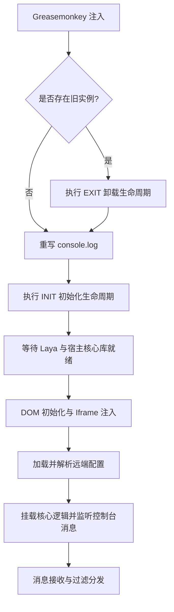
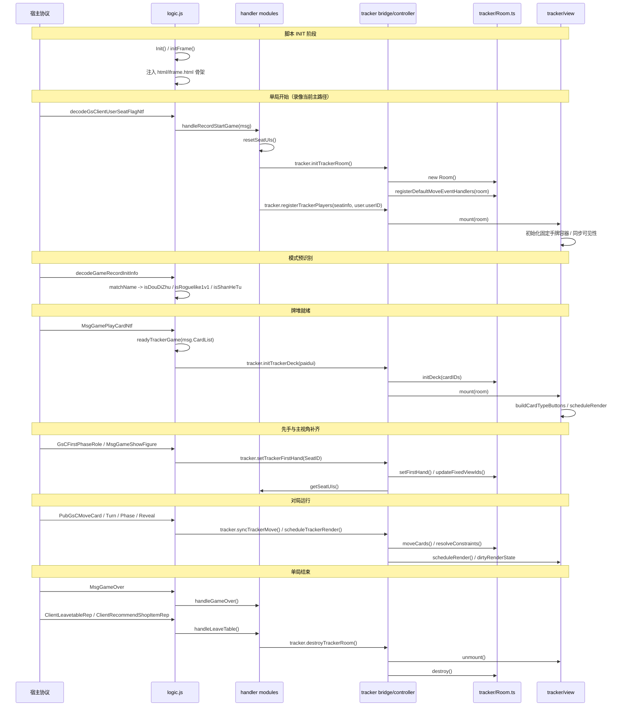
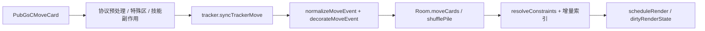

# 三国杀小抄项目生命周期机制

本文档说明应用整体运行周期、Room/View 挂载与销毁、局内状态流转，以及关键入口位置。
Room 内部状态所有权、行为模块与写入管线见 [`room.md`](room.md)。
**维护约定**：只引用文件路径与符号名，不绑定源码行号（避免 markdown 链接 hash 行号或 `路径:行号` 文案），避免代码移动后失效。

---

## 一、应用整体运行周期

入口文件为 [`src/index.js`](../../src/index.js)，核心流转如下：

### 1. 初始化阶段 (INIT)

- **触发条件**：脚本在 `document-start` 注入后执行；若已有 `SGSMODULE` 则先 EXIT，再劫持 `console.log`，最后调用 `main('INIT')`。
- **执行时序与入口**：
  1. [`src/index.js`](../../src/index.js) 的 `main('INIT')` 调用 [`src/dom.js`](../../src/dom.js) 的 `Init()`。
  2. `Init()` 调用 [`src/ui/lifecycle.js`](../../src/ui/lifecycle.js) 的 `bindInitialResize()` 绑定窗口缩放。
  3. `waitForLegacyFrameReady()` 轮询宿主依赖（`JSZipUtils`、`CtrUtil`、`SystemContext`、`#bgDiv`；微端 `PUERTS_JS_RESOURCES` 则直接通过）。
  4. 就绪后回调 [`src/dom.js`](../../src/dom.js) 的 `initFrame()`：
     - 清理残留注入 DOM；
     - 监听 `resize` / `SGSresize`；
     - `installSystemContextResizeDispatchers()` 代理 `SystemContext.gameScreenType` / `gameScale`；
     - `addSeatUI` + `addFrame()`，经 [`src/utils/htmlResource.js`](../../src/utils/htmlResource.js) 的 `loadInterfaceHtml()` 加载远端 `html/iframe.html`；
     - [`src/config/ConfigManager.js`](../../src/config/ConfigManager.js) 的 `loadAndParseConfigs()` 解析远端 `Config_w.sgs`。
  5. `main('INIT')` 的 Promise 成功后，将 `main` 推入 `window.SGSMODULE`。

### 2. 消息分发阶段

- **触发条件**：宿主输出日志，触发劫持后的 `console.log`。
- **执行时序与入口**：
  1. [`src/index.js`](../../src/index.js) 的 `sgsConsoleLog` 遍历 `window.SGSMODULE` 分发。
  2. `main` 提取消息对象，进入 [`src/logic.js`](../../src/logic.js) 的 `logic()`。
  3. [`src/featureFlags.js`](../../src/featureFlags.js) 的 `isRetainedLogicMessage()` 做白名单过滤。
  4. 按 `ClassName` / `className` 分发到 `src/handler/` 等处理器。

### 3. 卸载阶段 (EXIT)

- **触发条件**：页面重载、脚本热重载或显式卸载。
- **执行时序与入口**：
  1. [`src/index.js`](../../src/index.js) 若发现已有 `SGSMODULE`：将 `console.log` 临时改为 `console.info`，广播 `'EXIT'`，删除 `SGSMODULE`。
  2. [`src/dom.js`](../../src/dom.js) 的 `Exit()` → [`src/ui/lifecycle.js`](../../src/ui/lifecycle.js) 的 `cleanupLifecycle()`。
  3. 移除 `resize` / `SGSresize` 监听，清空 `SGSMODULE`。
  4. `removeInjectedDom()` 清理座位 UI、iframe、裴秀地图窗口与可见性快捷键绑定；山河图城市由 Laya 场景持有，不再注入 DOM 容器。

---

## 二、记牌器 Room 与 View 生命周期

浏览器侧默认控制器由 [`src/tracker/runtime/bridge.ts`](../../src/tracker/runtime/bridge.ts) 创建，经 [`src/tracker/runtime/browser.ts`](../../src/tracker/runtime/browser.ts) 导出 `tracker`（`TrackerController`）。

### 1. 应用 INIT：只准备承载环境

- 注入外层 DOM、座位覆盖层与主面板 HTML，加载配置，建立消息分发入口。
- **不会**调用 `initTrackerRoom()`，也**不会**执行 `view.mount()`。
- 视图依赖的 `#orderAndShouPai`、`#button`、`#knownCards`、`#paiduiCards`、`#qipaiCards`、`#cardDetail` 等节点来自 INIT 加载的 `html/iframe.html`。

### 2. 单局开始：创建 Room 并注册玩家

当前代码中的协议入口：

| 协议                            | 处理                                                                             | 说明                                                                                                                   |
| ------------------------------- | -------------------------------------------------------------------------------- | ---------------------------------------------------------------------------------------------------------------------- |
| `decodeGsClientUserSeatFlagNtf` | [`handleRecordStartGame()`](../../src/handler/StartGame.js)                      | **当前主动路径**（录像/座位旗标）；`resetSeatUIs` → `initTrackerRoom` → `registerTrackerPlayers` → 重置/裁剪覆盖层容器 |
| `GsCModifyUserseatNtf`          | `handleStartGame()` 已导出但在 [`logic.js`](../../src/logic.js) 中**注释未调用** | 历史开局入口；`IsGameStart` 时同样走 `initTrackerRoom` + 玩家注册。恢复时需重新接通分发                                |

执行顺序（以 `handleRecordStartGame` / `handleStartGame` 为准）：

1. `resetSeatUIs()`：清理上一局的座位数据与镜像，重置布局提交状态。
2. `tracker.initTrackerRoom()`（[`TrackerController`](../../src/tracker/runtime/trackerController.ts)）：销毁旧 Room，创建新 Room，注册默认移动事件处理器。
3. `tracker.registerTrackerPlayers(infos, user.userID)`：
   - `Room.registerPlayers()` 兼容 `SeatID`/`seat_id`、`ClientID`/`user_temp_id`；
   - 按 `user.userID` 匹配主视角；匹配不到则 `Game.isRecord = true`；
   - `size` / `seatIDs` 由 Room 写入，再 `syncRoomSeats` 到 Game；
   - 早期 `view.mount(trackerRoom)`（牌堆未就绪时只建固定手牌容器）。
4. 注册完成后重置并裁剪 `.sorderContainer`；`decodeGameRecordInitInfo` 可根据 `matchName` 预置 `isDouDiZhu` / `isRoguelike1v1` / `isShanHeTu`（不触发布局）。

### 3. 先手与固定视角

- `GsCFirstPhaseRole` → `tracker.setTrackerFirstHand(SeatID)`：写入 `firstID` 并执行 `updateFixedViewIds()`；主视角与先手都确定后计算 `.sorderContainer` 位置，但容器保持隐藏，首轮开始时再显示。
- `MsgGameShowFigure` 且 `Type == 1 && Figure === 1` 时也会 `setTrackerFirstHand`（身份/地主等）。
- 录像主视角还可由 `GsCUpdateRoleDataNtf`（StateID 58）、斗地主 `SmsgGameSetCharacter`、以及摸牌路径中的明牌首摸等兜底设置（见 `setTrackerMySeatID` / `gameFlowState`）。

### 4. 牌堆就绪

- **协议**：`MsgGamePlayCardNtf`
- **入口**：[`readyTrackerGame()`](../../src/logic.js)
- 根据牌堆特征设置 `isGuoZhan` / `isDouDiZhu` / `isShanHeTu`，`Game.resetConfigHandCards()`，再 `tracker.initTrackerDeck(paidui)` → `Room.initDeck()` → 完整 `view.mount()`。

### 5. 视图挂载与脏渲染

入口：[`src/tracker/view/index.ts`](../../src/tracker/view/index.ts)

- **早期挂载**（玩家已注册、`isDeckReady === false`）：`initPlayerHandContainers`，`syncTrackerVisibility`，不访问 `CardCounter`。
- **完整挂载**（`initDeck` 之后）：`buildCardTypeButtons`，`markViewDirty` / `markFullPlayerRender`，`scheduleRender()`。
- **渲染合并**：`scheduleRender` → `requestAnimationFrame` → `flushRender`。
- **脏状态**：[`dirtyRenderState.ts`](../../src/tracker/view/dirtyRenderState.ts) 的 `collectDirtyRenderState` 决定是否重绘面板、全量或局部玩家手牌；无脏变更时跳过 DOM。
- **可见性**：[`src/ui/trackerVisibility.ts`](../../src/ui/trackerVisibility.ts) 控制记牌器显隐快捷键；`mount`/`flushRender` 会 `reapplyHiddenTrackerVisibility`。
- 玩家手牌渲染依赖 `firstID` 与全部 `fixedViewId` 就绪；未解析完座位顺序时不落手牌 DOM。

### 6. 对局运行

- `PubGsCMoveCard`：[`handleMoveCard()`](../../src/handler/PubGsCMoveCard.js) 做预处理、特殊区域（`specialZones`）、局流状态（`gameFlowState`）、技能辅助（`spellEffects` / `skills/*`），再 `tracker.syncTrackerMove()` → `Room.moveCards()` / `shufflePile()`。
- `MsgGameTurnNtf`：`handleGameTurn` 在首轮先隐藏主视角，再显示已完成定位的 `.sorderContainer`。随后调用纯状态
  `Game.setTurn`，重置轮级战法 Laya 状态，最后 `scheduleTrackerRender`；容器重置与超出人数的容器隐藏在开局注册后完成。
- `GsCGamephaseNtf`：`handleGamePhase` 按 `SeatRoundState` 编排阶段消息，调用纯状态
  `Game.enter`，再处理阶段 DOM、回合结果清理与战法 Laya 状态，最后
  `scheduleTrackerRender`。
- 看牌/展示：`revealTrackerCardsInZone` 等把协议区映射为 Room 明牌输入。

### 7. 单局结束

| 协议                         | 入口                                                     | 专属行为                                                  |
| ---------------------------- | -------------------------------------------------------- | --------------------------------------------------------- |
| `MsgGameOver`                | [`handleGameOver()`](../../src/handler/MsgGameOver.js)   | “屏蔽MVP结算”开启时，合并重复消息并依次关闭结果、MVP 窗口 |
| `ClientLeavetableRep`        | [`handleLeaveTable()`](../../src/handler/MsgGameOver.js) | 只清理对局                                                |
| `ClientRecommendShopItemRep` | `handleLeaveTable()`                                     | 当前用户退出录像时的清理兜底                              |

两个入口最终复用 `cleanupGame()` 完成通用清理：隐藏 `.mizhu`、`Game.end()`（立即清空本局
统一状态仓库）、销毁裴秀地图窗口、
`resetSeatUIs()`，并由 `tracker.destroyTrackerRoom()` 依次卸载视图、销毁 Room、清空控制器中的
`trackerRoom`。

---

## 三、数据流转与状态变更

### 1. 轮次 (Turn)

- `MsgGameTurnNtf` → `handleGameTurn` → `Game.setTurn(turn)`
- `Game.setTurn` 只更新轮次状态；handler 清理首轮座位覆盖并重置轮级战法
  Laya 状态，最后调用 `scheduleTrackerRender`

### 2. 回合与阶段 (Round & Phase)

- `GsCGamephaseNtf` → `handleGamePhase` → `Game.enter(round, seat)`
- `round === 0`：`Game.enter` 只推进动作角色、回合计数与技能状态；handler
  负责重置上一行动玩家的战法、清理回合结果 DOM 并更新阶段标签
- `round > 0`：`Game.enter` 推进阶段计数；handler 根据 `SeatRoundState`
  更新顶部阶段指示

状态机主体与浏览器运行时实例统一在 [`Game.ts`](../../src/tracker/Game.ts)
（`GameState` 类 + `Game` 实例），玩家阶段消息的 DOM/Laya 副作用集中在
[`GsCGamephaseNtf.js`](../../src/handler/GsCGamephaseNtf.js)。

### 3. 卡牌移动

---

## 四、核心入口索引（无行号）

| 生命周期阶段 | 核心符号                                                   | 源码位置                                                                                                                                                                     | 职责                                  |
| ------------ | ---------------------------------------------------------- | ---------------------------------------------------------------------------------------------------------------------------------------------------------------------------- | ------------------------------------- |
| 应用装载     | `main('INIT')`                                             | [`src/index.js`](../../src/index.js)                                                                                                                                         | 脚本入口与消息订阅                    |
| 库就绪轮询   | `waitForLegacyFrameReady`                                  | [`src/ui/lifecycle.js`](../../src/ui/lifecycle.js)                                                                                                                           | 等待宿主依赖                          |
| DOM 注入     | `initFrame`                                                | [`src/dom.js`](../../src/dom.js)                                                                                                                                             | 注入 UI 骨架与配置加载                |
| 配置解析     | `loadAndParseConfigs`                                      | [`src/config/ConfigManager.js`](../../src/config/ConfigManager.js)                                                                                                           | 解析 `Config_w.sgs`                   |
| 单局 Room    | `tracker.initTrackerRoom`                                  | [`trackerController.ts`](../../src/tracker/runtime/trackerController.ts)                                                                                                     | 创建 Room 与移动装饰器                |
| 玩家注册     | `tracker.registerTrackerPlayers`                           | 同上                                                                                                                                                                         | 座位、主视角、早期 mount              |
| 录像开局     | `handleRecordStartGame`                                    | [`StartGame.js`](../../src/handler/StartGame.js)                                                                                                                             | 当前座位旗标开局路径                  |
| 历史开局     | `handleStartGame`                                          | 同上                                                                                                                                                                         | 导出保留；`logic` 中暂未调用          |
| 模式预识别   | `logic`                                                    | [`src/logic.js`](../../src/logic.js)                                                                                                                                         | `decodeGameRecordInitInfo`            |
| 先手补齐     | `setTrackerFirstHand`                                      | `trackerController` / `Room`                                                                                                                                                 | 固定视角与座位 UI                     |
| 牌堆就绪     | `readyTrackerGame`                                         | [`src/logic.js`](../../src/logic.js)                                                                                                                                         | 模式确认 + `initTrackerDeck`          |
| 物理牌堆     | `initDeck`                                                 | [`Room.ts`](../../src/tracker/Room.ts)                                                                                                                                       | 牌实例与 counter                      |
| 视图挂载     | `mount` / `scheduleRender`                                 | [`view/index.ts`](../../src/tracker/view/index.ts)                                                                                                                           | 两段式挂载与脏渲染                    |
| 可见性       | `applyTrackerVisibility`                                   | [`trackerVisibility.ts`](../../src/ui/trackerVisibility.ts)                                                                                                                  | 快捷键显隐                            |
| 回合轮次     | `setTurn` / `handleGameTurn` / `enter` / `handleGamePhase` | [`Game.ts`](../../src/tracker/Game.ts) / [`MsgGameTurnNtf.js`](../../src/handler/MsgGameTurnNtf.js) / [`GsCGamephaseNtf.js`](../../src/handler/GsCGamephaseNtf.js) | 局内状态推进与回合/阶段 DOM/Laya 编排 |
| 脚本卸载     | `cleanupLifecycle`                                         | [`src/ui/lifecycle.js`](../../src/ui/lifecycle.js)                                                                                                                           | 移除监听与 DOM                        |
| Room 销毁    | `destroyTrackerRoom`                                       | `trackerController`                                                                                                                                                          | unmount + destroy                     |
