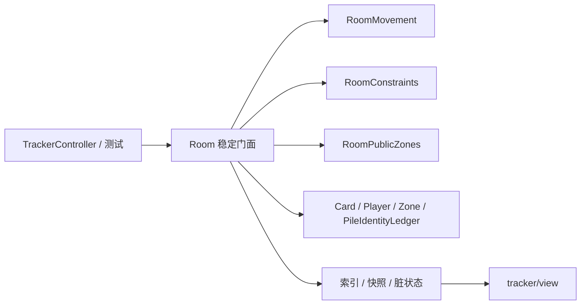

# Room 单局状态容器（渐进式披露）

> 当任务涉及 `src/tracker/Room.ts`，需要判断状态应由谁持有、入口应放在 Room 还是行为模块、
> 或排查单局初始化、移动、收敛、索引同步与销毁问题时，按需阅读本文。
> 只想调用现有能力时先查 [`tracker_api.md`](tracker_api.md)；应用级创建、View 挂载与销毁时序见
> [`lifecycle.md`](lifecycle.md)；GameState 统一单局状态仓库及 Room 访问入口见
> [`skill_state.md`](skill_state.md)。

## 阅读路由

| 当前任务 | 建议阅读 | 说明 |
| --- | --- | --- |
| 快速理解 Room 的职责与主流程 | 本文第一至四层 | 单局状态源、生命周期、状态所有权、写入管线 |
| 查找读取、移动、揭示或物化 API | [`tracker_api.md`](tracker_api.md) | 稳定公开入口与调用示例 |
| 修改 `Card` / `Player` / `Zone` | [`card_player_model.md`](card_player_model.md) | 实体字段、候选主模型、玩家投影与公共区顺序 |
| 修改约束或排查不收敛 | [`card_tracker_convergence.md`](card_tracker_convergence.md) | 不动点、数量约束、`changed` 契约与性能护栏 |
| 处理匿名槽、物化、洗牌身份 | [`card_tracker_anonymous_pile.md`](card_tracker_anonymous_pile.md) | cohort/generation、身份分区与 `PileIdentityLedger` |
| 处理技能或协议特例 | [`card_tracker_skills.md`](card_tracker_skills.md) / [`../protocols/README.md`](../protocols/README.md) | 技能装饰、协议字段样例与特殊移动语义 |
| 使用技能临时状态 | [`skill_state.md`](skill_state.md) | GameState 统一仓库、命名空间、Room 薄入口与当前技能清单 |
| 排查 Room 创建、挂载或销毁 | [`lifecycle.md`](lifecycle.md) | Controller、Room、View 的应用级时序 |
| 选择回归命令或补测试 | [`testing.md`](testing.md) | tracker 测试、类型检查、lint 与构建 |

## 第一层：先建立最小模型

`Room` 是一局牌局的状态权威和稳定门面，不是全局单例、原始协议解析器或 DOM 视图。

- 浏览器运行时由 `TrackerController` 创建并持有当前 Room；业务代码通常通过
  `tracker.getReadyTrackerRoom()` 获取已完成牌堆初始化的实例。
- 测试优先使用 `tests/tracker/helpers/room.ts` 的 `createTestRoom()`，避免重复手写初始化步骤。
- `Room` 持有单局事实、身份分区、约束与派生索引；状态写入统一经 Controller 或 Room 公开入口。
- `RoomMovement`、`RoomConstraints`、`RoomPublicZones` 只持有 Room 引用并执行分阶段行为，
  不拥有另一套独立推断状态。
- `resolveConstraints()` 是稳定投影边界：候选与物理状态写入后，经它收敛并同步索引、玩家视图组、
  计数器和一致性检查。

## 第二层：单局生命周期

| 阶段 | 核心入口 | Room 状态 |
| --- | --- | --- |
| 构造 | `new Room({ gameState })` | 创建公共 `Zone`、行为模块、约束/索引容器与身份账本，并绑定本局 `GameState`；此时还没有可运行牌堆 |
| 注册座位 | `registerPlayers(infos, currentUserID)` | 重建 `players`、`seatIDs`、`size`，识别 `mySeatID`，同步录像状态与固定视角前置数据 |
| 初始化牌堆 | `initDeck(cardIDs)` | 清空旧牌池，创建等量匿名物理槽，登记真实身份，初始化 generation 0、索引、快照与 `CardCounter`，最后置 `isDeckReady = true` |
| 对局运行 | `moveCards()` / `shufflePile()` / reveal 相关入口 | 更新物理实体、身份账本、候选与手牌数事实，再执行收敛和派生同步 |
| 销毁 | `destroy()` | 与 `GameState` 解绑并触发统一临时状态清理，再清空玩家、Zone、牌实体、约束、身份分区、脏状态和座位信息；整个实例随即失效，不再被 Controller 复用 |

浏览器侧可能在玩家注册后进行一次早期 View 挂载，但只有 `initDeck()` 完成后 Room 才能通过
`getReadyTrackerRoom()` 对外提供完整记牌能力。具体挂载时序不要在 Room 内推断，见
[`lifecycle.md`](lifecycle.md)。

## 第三层：Room 持有什么

### 权威事实

| 分区 | 代表字段 | 语义 |
| --- | --- | --- |
| 座位与视角 | `players`、`seatIDs`、`size`、`mySeatID`、`firstID` | 本局玩家集合、主视角与固定显示顺位前置事实 |
| 物理牌实体 | `cards`、`zones`、`cardIndex` | 已创建的 `Card` 实体、公共区有序关系与已定位正 ID 索引 |
| 身份分区 | `deckIdentities`、`unlocatedIdentities`、`suspendedKnownCards`、`pileIdentityLedger` | 暗牌堆真实身份集合、未定位身份、暂停展示实体与 cohort/generation 权威账本 |
| 推断约束 | `constraintGroups` | 局部位置/数量约束 |
| 技能临时账本 | GameState `tracker` scope（经 `read/ensure/set/deleteSkillState` 访问） | 当前 Room 的技能推断状态；存储和生命周期由 GameState 统一管理 |
| 扩展注册表 | `skillHandlers`、`moveEventHandlers` | 移动装饰器与事件处理器；随 Room 销毁，不跨局复用状态 |

### 派生状态与缓存

| 分区 | 代表字段 | 更新方式 |
| --- | --- | --- |
| 位置投影 | `locationIndex` | `resolveConstraints()` 消费卡牌脏事件和公共区脏集合，断档时全量重建 |
| 模糊明牌反查 | `ambiguousKnownIndex` | 通常增量更新；约束组结构变化时全量重建 |
| 计数查询 | `counter` | `initDeck()` 后创建，收敛尾部按脏牌增量更新 |
| 玩家区快照 | `playerCardsSnapshot` 及游标 | 收敛循环按 `dirtyCardEvents` 增量刷新，断档时回退全量 |
| View 脏状态 | `viewDirty`、`dirtyCards`、`dirtyCardEvents`、`dirtyPublicZones` | 由卡牌/Zone 变更入口记录，供索引和视图各自按游标消费 |

派生数组、索引桶和快照都不是写入事实。不要直接修改 `locationIndex`、
`Player.knownHandCards`、`Player.candidateHandCards` 或其它视图分组。

## 第四层：状态写入管线

### 普通协议移动

原始协议消息先由 `src/handler/PubGsCMoveCard.js` 完成协议预处理、位置规范化、`CardIDs` 修正和
技能副作用，再交给 `src/tracker/runtime/bridge.ts` 装配的 `tracker` 同步归一化移动。不要在
handler 中直接修改 `Card`、`Zone` 或玩家投影；`TrackerController` / bridge 只负责归一化事实的
运行时同步、Room 生命周期和入口连接。

`Room.moveCards()` 保留高频主流程，阶段细节委托给 `RoomMovement`：

1. `createMoveContext()` 统一已知 ID、物理数量、来源/目标、手牌差量和特殊选项。
2. 对必须匿名化的模糊来源实体先整批预检，避免产生半完成状态。
3. 写入来源与目标手牌总数差量，并在整手揭示前置处理暗置标记候选。
4. 解析已知牌，必要时物化匿名槽；传播候选，再分别移动匿名牌和已知牌。
5. 写入公共位置候选或局部 `ConstraintGroup`。
6. 调用 `resolveConstraints()`，稳定所有派生状态并执行守恒检查。

移动的端点取牌、公共候选、随机手牌转移和已知/匿名置换细节，应继续下钻到
`src/tracker/roomMovement.ts`、`src/tracker/roomMovement/` 及对应协议/技能文档。

### 收敛尾部

`resolveConstraints()` 的概念顺序是：

1. 从完整位置候选同步确定 owner。
2. 收敛局部 `ConstraintGroup`。
3. 根据观测手牌数执行暗牌额度与排他约束。
4. 对账需要创建或释放的匿名手牌实体，直到达到不动点。
5. 暂停候选范围过宽的明牌。
6. 更新 `locationIndex`、玩家视图组、`ambiguousKnownIndex` 与 `CardCounter`。
7. 执行玩家快照、索引、公共区、实体与身份守恒断言。

终止性、触碰座位缓存、脏事件游标和 `changed` 幂等契约统一见
[`card_tracker_convergence.md`](card_tracker_convergence.md)。

### 洗牌

`shufflePile()` 不是普通 `moveCards()` 的简单组合。真实弃牌洗回时必须先让
`PileIdentityLedger` 原子提交 generation 过渡，再按提交结果处理匿名化、suspended 身份与物理牌堆重建；
只随机弃牌堆部分，保留原剩余牌堆相对顺序。完整语义见
[`card_tracker_anonymous_pile.md`](card_tracker_anonymous_pile.md)。

### 高风险移动边界

以下边界会同时影响物理槽、候选与身份守恒，只在相关任务中继续下钻：

- `materialize()` 只能接管合适的匿名槽、同 ID 端点实体或可恢复的 outside/suspended 身份，
  不能用未定位身份覆盖另一张正 ID 暗公共实体。
- 公共区已知牌物化只在本次协议 `cardCount` 覆盖的端点范围内分配匿名槽；不能穿透正 ID 暗端点
  扫描更深处的牌，也不能把同批后一张牌回塞到前一张已经消费的物理位置。
- 公共区无 CardIDs 的匿名移动通常只消费匿名槽；牌堆路径不得仅因已知实体位于端点就推断其
  身份失效。非牌堆公共区则必须遵守各自真实端点语义。
- 玩家来源明牌移入公共区而旧公共槽仍占位时，回补必须服从确定来源和同批隔离，不能让同批
  已知牌互相充当占位，也不能用实体数组顺序提前裁决跨座位随机候选。
- `seats.size === 1` 只说明 owner 已确定；若完整位置仍可能是同一玩家的手牌或标记区，必须继续
  保留子区域候选，不能直接落定。

匿名端点、置换、物化与洗牌的完整守恒规则见
[`card_tracker_anonymous_pile.md`](card_tracker_anonymous_pile.md)；随机手牌、暗置标记和技能特例见
[`card_tracker_skills.md`](card_tracker_skills.md) 及具体协议专页。

## 第五层：新增逻辑应放在哪里

| 变更类型 | 首选位置 | 原因 |
| --- | --- | --- |
| 协议预处理、位置规范化、`CardIDs` 修正、技能副作用 | `src/handler/PubGsCMoveCard.js` | 统一处理原始协议字段并桥接归一化移动 |
| 归一化移动同步、Room 创建/销毁与运行时同步 | `src/tracker/runtime/bridge.ts`、`trackerController.ts` | 连接 handler、Room 与生命周期 |
| `moveCards()` 某个低频阶段或来源取牌规则 | `roomMovement.ts` / `roomMovement/*` | 保持 Room 中的高频主流程短而稳定 |
| 约束组、暂停追踪、视图组同步 | `roomConstraints.ts` | 集中维护推断和稳定投影规则 |
| 公共区查询、牌序读面、一致性诊断 | `roomPublicZones.ts` | 避免在 Room 重复实现 Zone 遍历 |
| 稳定且高频的单局公开入口 | `Room.ts` 的薄门面 | 便于调用方检索与引用追踪 |
| 技能专属事件装饰与临时账本 | `src/tracker/skill/` + GameState `tracker` 状态 | 技能状态按局隔离，Room 仅提供领域访问入口 |
| 牌实体、玩家事实或公共区模型语义 | `Card.ts` / `Player.ts` / `Zone.ts` | 由对应模型维护自身不变量 |
| DOM、挂载、渲染合并与显隐 | `src/tracker/view/` / `src/ui/` | Room 只记录可供视图消费的状态与脏事件 |

新增内部辅助方法时，先判断它是在维护 Room 的权威状态，还是某个行为阶段的实现细节。后者优先放入
对应行为模块，再由 Room 暴露必要的薄入口。

## 第六层：核心不变量与修改护栏

- `Room` 只代表一局；GameState 中的 tracker 临时状态、事件处理器、身份账本和索引不能跨 Room 复用。
- `Room.cards` 是物理实体集合，不等于仍未出现的真实身份集合；生产 `initDeck()` 只创建匿名槽。
- `Zone` 只表达公共区有序关系；玩家区事实由 `Card.location === 'player'` 与完整位置候选表达。
- `Card.locationCandidates` 是完整位置候选主模型；`seats`、子区候选和公共候选是投影。
- `isKnown`、真实 CardID、位置确定是三个不同维度，不能互相推导。
- 普通状态变更必须进入脏事件链；候选缩小时保留 `previousSeats`，否则增量收敛与索引会漏更新。
- 低层候选或实体写入后，在读取稳定索引/玩家视图组前调用 `resolveConstraints()`。
- 不要直接向 `room.cards`、玩家投影数组或索引桶 `push`；不要用 `Zone.add()` 代替协议移动。
- 物化已有身份优先使用 `materialize()`；不要为同一真实 ID 另建一张 `Card`。
- 洗牌必须保持身份账本事务先于物理区重建，不能绕过 generation 与 Room/ledger 一致性检查。

## 第七层：按症状诊断

| 症状 | 优先检查 |
| --- | --- |
| `room` 为 `null`、牌堆未就绪或 View 挂载顺序异常 | [`lifecycle.md`](lifecycle.md) 与 `TrackerController` |
| 牌从错误端点取出、落错区或物理数量不符 | `Room.moveCards()`、`RoomMovement`、[`card_player_model.md`](card_player_model.md) |
| 正 ID 重复、匿名槽丢失、洗牌后身份异常 | [`card_tracker_anonymous_pile.md`](card_tracker_anonymous_pile.md) |
| 候选过度收敛、欠收敛、轮数异常或遍历上涨 | [`card_tracker_convergence.md`](card_tracker_convergence.md) |
| Room 状态正确但 UI 未刷新或分组陈旧 | `dirtyCardEvents`、`dirtyPublicZones`、`locationIndex`、`src/tracker/view/` |
| 只有某个 className / SpellID 出错 | [`../protocols/README.md`](../protocols/README.md) 与 [`card_tracker_skills.md`](card_tracker_skills.md) |

## 源码入口

- `src/tracker/Room.ts`：稳定门面、单局状态、生命周期与高频主流程。
- `src/tracker/roomMovement.ts`、`src/tracker/roomMovement/`：移动阶段实现。
- `src/tracker/roomConstraints.ts`：约束、暂停追踪与玩家视图组同步。
- `src/tracker/roomPublicZones.ts`：公共区查询与一致性诊断。
- `src/tracker/runtime/trackerController.ts`：Room 创建、协议同步、揭示、渲染调度与销毁。
- `src/tracker/Card.ts`、`Player.ts`、`Zone.ts`：Room 持有的核心领域模型。
- `src/tracker/PileIdentityLedger.ts`：匿名牌堆身份事务权威。

修改 Room 或其行为模块后，按 [`testing.md`](testing.md) 运行 tracker 回归、类型检查、lint 与 build；
仅修改本文档及阅读路由无需构建。
