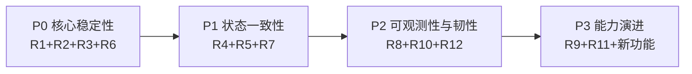
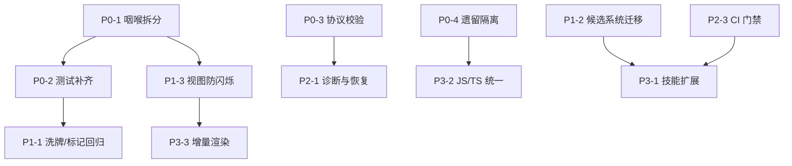

# 记牌器产品风险评估与更新路线图 — 总览

> 📅 2026-06-30 | 状态：设计评审中

---

## 背景

本项目（三国杀打小抄）于 2026-06-26 初始提交，2026-06-28 从原型阶段毕业，至今经历 8 次提交，核心记牌器已从旧链表模型完全迁移到 `src/tracker/` 的 Room/Card/ConstraintGroup 新架构。

当前是建立"质量基线"的最佳窗口：架构刚定型、技术债务尚轻、但协议脆弱性和测试覆盖不足已构成运行时风险。

## 路线图总方向

**先加固基础再扩展能力**：优先解决技术防御性风险（协议兼容、测试覆盖、状态一致性），确保现有功能不崩，再逐步扩展技能覆盖和用户体验。

## 风险全景图

基于代码深度分析的 12 项风险，按「运行时暴露面 × 发生概率 × 影响范围」分为 P0/P1/P2/P3 四级：

| 风险 ID | 风险名称 | 等级 | 代码定位 | 影响范围 |
|---------|---------|------|---------|---------|
| R1 | 协议咽喉单点故障 | P0 | `src/handler/PubGsCMoveCard.js:handleMoveCard()` | 所有卡牌移动追踪 |
| R2 | 高风险路径测试缺失 | P0 | `src/tracker/Room.ts:moveCards()` | 状态推断准确性 |
| R3 | 协议字段无校验 | P0 | `src/tracker/MoveEventNormalizer.ts`、`protocolZones.ts` | 全局可用性 |
| R4 | 状态一致性边缘情况 | P1 | `roomMovement.ts`、`roomConstraints.ts` | 复杂局面推断 |
| R5 | 候选系统四套并行 | P1 | `src/tracker/Card.ts` | 代码认知负担 |
| R6 | 遗留代码误引用 | P0 | `handler/old/`、`legacyMoveCard.js` | 维护安全性 |
| R7 | 视图整区重绘 | P1 | `src/tracker/view/index.ts` | 视觉稳定性 |
| R8 | 远端资源无降级 | P2 | `ConfigManager.js`、`htmlResource.js` | 首次加载可靠性 |
| R9 | JS/TS 混合边界 | P3 | `src/handler/` vs `src/tracker/` | 类型安全 |
| R10 | 无运行时诊断 | P2 | `errorNotifier.js` | 问题排查效率 |
| R11 | 技能覆盖不全 | P3 | `moveEventHandlers.ts` | 记牌准确性 |
| R12 | 无 CI/CD | P2 | `package.json` | 质量门禁 |

## 路线图阶段总览

各阶段详细设计见：

- [`P0 核心稳定性`](2026-06-30-risk-roadmap-p0.md)
- [`P1 状态一致性`](2026-06-30-risk-roadmap-p1.md)
- [`P2 可观测性与韧性`](2026-06-30-risk-roadmap-p2.md)
- [`P3 能力演进`](2026-06-30-risk-roadmap-p3.md)

## 阶段依赖关系

## 成功标准

每个阶段结束时，需要验证：

1. `pnpm lint` 通过
2. `pnpm typecheck:tracker` 通过
3. `pnpm test:tracker` 通过，且覆盖率不低于阶段基线
4. `pnpm build` 通过
5. 阶段目标中定义的具体验收条件达成
