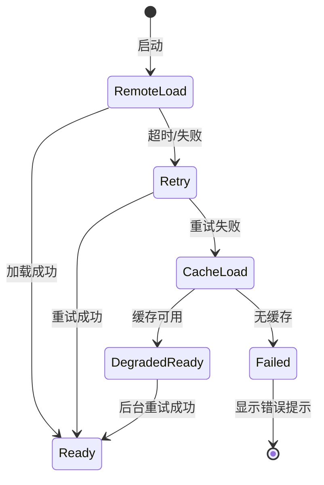

# P2 可观测性与韧性 — 详细设计

> 📅 2026-06-30 | 父文档：[`总览`](2026-06-30-risk-roadmap-overview.md)
>
> 解决风险：R8 远端资源无降级 / R10 无运行时诊断 / R12 无 CI/CD
>
> 前置条件：P0 完成（协议校验断路器就绪）

---

## 目标

让系统能自我诊断、优雅降级、自动守门。P2 完成后，线上问题可通过诊断日志快速定位，网络故障不会导致功能完全不可用，代码提交有自动化质量门禁。

---

## P2-1: 运行时诊断与错误恢复

### 当前问题

- `src/utils/errorNotifier.js` 只将错误 `saveRecord` 到 localStorage，无恢复机制
- 无协议消息日志，出现追踪异常时无法事后排查
- 无用户可访问的诊断信息导出通道

### 改进方案

#### 错误恢复策略

在 `TrackerController` 层面添加异常隔离与恢复：

1. `syncTrackerMove()` 中的异常被 P0-3 的 try-catch 捕获
2. 记录异常上下文（当前消息摘要、Room 状态快照）
3. 如果同一局内异常次数超过阈值（如 3 次），进入降级模式：停止后续 tracker 同步尝试，但继续隔离宿主消息链异常
4. 在 UI 中显示降级提示，并保留最近一次异常上下文用于诊断导出
5. 不自动销毁并重建 Room；只有在具备快照/回放或人工确认的可恢复来源后，才设计主动重建流程

#### 协议消息摘要日志

- 在 `src/utils/logger.js` 中扩展日志系统，支持可开关的协议消息摘要
- 日志格式：`[turn:round:phase] MoveType=X From=Zone:SeatID To=Zone:SeatID CardCount=N KnownCount=M`
- 默认关闭，通过设置面板或控制台命令开启
- 日志缓冲区使用环形 buffer，保留最近 200 条，避免内存泄漏

#### 诊断信息导出

- 添加诊断导出功能：将当前 Room 状态序列化为 JSON
- 内容包括：玩家列表、已知牌分布、候选状态、约束组、公共区状态
- 通过控制台命令或 UI 按钮触发
- 敏感信息（如用户 ID）在导出时脱敏

### 验收条件

- [ ] 记牌器异常不阻断宿主消息链，超过阈值后进入可见降级模式
- [ ] 协议消息摘要日志可开关
- [ ] 诊断信息可导出为 JSON
- [ ] 日志缓冲区有容量上限，不造成内存泄漏

---

## P2-2: 配置与资源降级

### 当前问题

- `src/config/ConfigManager.js` 从远端加载 `Config_w.sgs`，网络故障时无备案
- `src/utils/htmlResource.js` 从远端加载界面 HTML，无超时、无重试、无缓存
- 首次使用时如果网络不稳定，整个脚本功能不可用

### 改进方案

#### ConfigManager 本地缓存层

1. 配置加载成功后，缓存到 IndexedDB（优先）或 localStorage
2. 缓存 key 包含版本标识（基于内容 hash 或时间戳）
3. 下次加载时先尝试远端，超时（5 秒）后使用缓存版本
4. 使用缓存版本时在 UI 中提示"使用缓存配置，可能不是最新"

#### htmlResource 韧性增强

1. 添加加载超时（10 秒）
2. 超时后重试 1 次
3. 仍失败时，尝试使用 localStorage 缓存的上次成功加载内容
4. 完全失败时显示友好错误提示而非空白

#### 降级状态机



### 验收条件

- [ ] 配置加载成功后写入本地缓存
- [ ] 远端不可用时使用缓存版本并提示
- [ ] HTML 资源加载有超时和重试机制
- [ ] 完全失败时有友好错误提示

---

## P2-3: CI 质量门禁

### 当前问题

- 无 CI/CD 配置
- `pnpm test:tracker` / `pnpm lint` / `pnpm build` 仅手动运行
- 无测试覆盖率追踪

### 改进方案

#### GitHub Actions 配置

创建 `.github/workflows/ci.yml`：

```yaml
# 伪代码示意
on: [push, pull_request]
jobs:
  quality:
    steps:
      - pnpm install
      - pnpm lint
      - pnpm typecheck:tracker
      - pnpm test:tracker
      - pnpm build
```

#### 质量门禁规则

| 检查项 | 触发条件 | 阻断 PR |
|-------|---------|--------|
| `pnpm lint` | 所有 push/PR | 是 |
| `pnpm typecheck:tracker` | 所有 push/PR | 是 |
| `pnpm test:tracker` | 所有 push/PR | 是 |
| `pnpm build` | 所有 push/PR | 是 |
| `pnpm build:prod` | PR 到 main | 是 |

#### 测试覆盖率基线

- 使用 Vitest 内置覆盖率报告（`@vitest/coverage-v8`）
- 设置 `src/tracker/` 目录的覆盖率基线
- 不强制 100%，但不允许覆盖率下降

### 验收条件

- [ ] GitHub Actions CI 配置就绪
- [ ] push/PR 自动运行 lint + typecheck + test + build
- [ ] 测试覆盖率有基线报告
- [ ] PR 到 main 额外运行 `build:prod`
